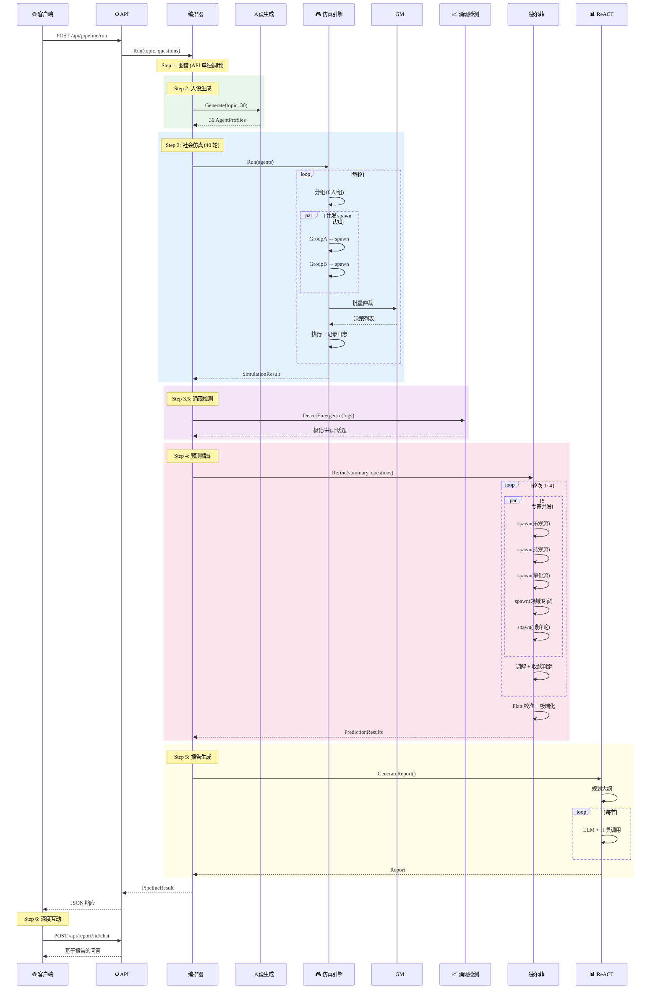
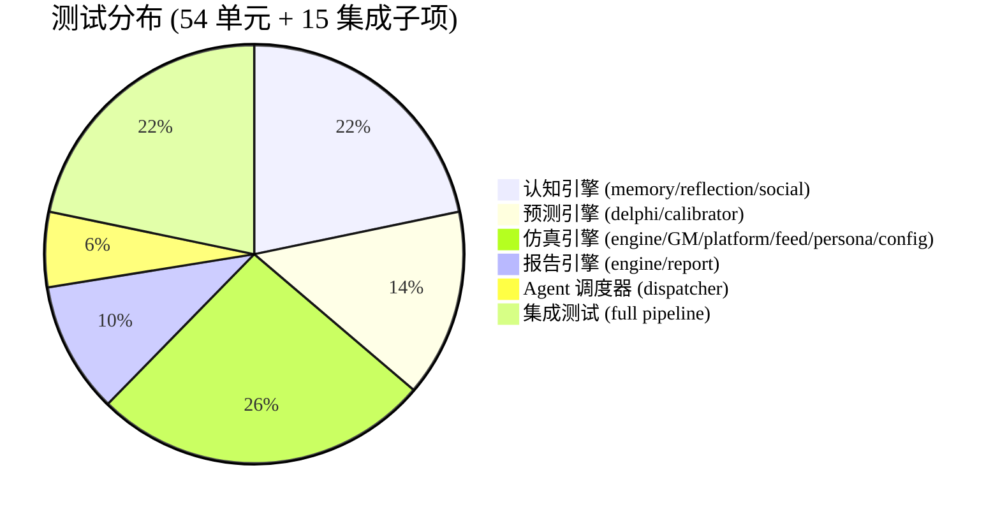

# MiroFish V2 — 代码实现状态报告

> **统计**: 45 个源文件 · 5714 行 Go 代码 · 54 单元测试 + 15 集成子测试 · 全部通过 (race detector)

---

## 一、完整项目目录

```
code/
├── cmd/server/
│   └── main.go                              # 服务入口 (环境变量配置, Mock 降级)
│
├── internal/
│   ├── model/
│   │   └── types.go                         # 所有领域模型: Agent/Post/Decision/Prediction/Report...
│   │
│   ├── openclaw/                            # ← OpenClaw Gateway 客户端层
│   │   ├── client.go                        # ChatCompleter + Spawner 接口 + HTTP 实现
│   │   └── mock_client.go                   # 完整 Mock (Handler 注入 / FIFO 队列 / 辅助函数)
│   │
│   ├── cognitive/                           # ← 🧠 认知引擎 (借鉴 Smallville)
│   │   ├── memory.go                        # 记忆流: 三维加权检索 (时效×重要性×相关性)
│   │   ├── memory_test.go                   #   8 个测试
│   │   ├── reflection.go                    # 反思引擎: 阈值触发 → 生成问题 → 合成洞察
│   │   ├── reflection_test.go               #   3 个测试
│   │   ├── planning.go                      # 层级计划: 日→小时→当前步骤, 突发事件调整
│   │   ├── social.go                        # 社会感知图: 声誉/影响力/好感度 (借鉴 Project Sid)
│   │   └── social_test.go                   #   4 个测试
│   │
│   ├── agent/                               # ← 🤖 Agent-Block-Action 架构 (借鉴 AgentSociety)
│   │   ├── block.go                         # Block 接口 + Agent 核心结构
│   │   ├── dispatcher.go                    # Block 调度器: 优先级解析 + 批量分发
│   │   ├── dispatcher_test.go               #   4 个测试
│   │   └── blocks/                          # ← 可插拔 Block 模块
│   │       ├── memory_block.go              #   记忆检索 + 观察写入
│   │       ├── reflection_block.go          #   反思触发 (每 3 轮)
│   │       ├── planning_block.go            #   计划生成/调整
│   │       ├── social_block.go              #   社交评估 → 更新社会图
│   │       ├── posting_block.go             #   发帖决策 (LLM 驱动)
│   │       └── reaction_block.go            #   互动策略 (点赞/回复/转发)
│   │
│   ├── simulation/                          # ← 🎮 仿真引擎 (借鉴 Concordia GM)
│   │   ├── engine.go                        # 编排器: 分组 spawn → GM 仲裁 → 执行
│   │   ├── engine_test.go                   #   8 个测试
│   │   ├── game_master.go                   # GM 仲裁: 规则引擎(简单行为) + LLM(复杂行为)
│   │   ├── platform.go                      # 虚拟社交平台 (帖子/点赞/回复/转发)
│   │   ├── feed.go                          # 个性化信息流: 时效+互动+社交+话题相关性
│   │   ├── feed_test.go                     #   5 个测试
│   │   ├── emergence.go                     # 涌现信号检测: 极化指数/共识度/热门话题
│   │   ├── grouper.go                       # Agent 分组策略
│   │   ├── logger.go                        # JSONL 行为日志
│   │   ├── persona.go                       # LLM 人设生成器 (单次/Spawn 批量)
│   │   ├── persona_test.go                  #   2 个测试
│   │   ├── config.go                        # YAML 配置加载 (experts.yaml)
│   │   └── config_test.go                   #   3 个测试
│   │
│   ├── prediction/                          # ← 🔮 预测精炼引擎 (借鉴 DeLLMphi)
│   │   ├── delphi.go                        # 德尔菲编排: 多轮专家辩论 + 收敛判定
│   │   ├── delphi_test.go                   #   3 个测试
│   │   ├── expert.go                        # 5 个默认专家视角 (乐观/悲观/量化/领域/博弈)
│   │   ├── mediator.go                      # 调解 Agent: 分歧分析 + 反馈生成
│   │   ├── calibrator.go                    # Platt 缩放 + 极端化修正 + 统计工具
│   │   └── calibrator_test.go               #   7 个测试
│   │
│   ├── react/                               # ← 📊 ReACT 报告引擎
│   │   ├── engine.go                        # ReACT 循环: 规划大纲 → 工具调用 → 分节生成
│   │   ├── engine_test.go                   #   3 个测试
│   │   ├── tools.go                         # 工具集: 图谱搜索/仿真数据/涌现分析/预测结果
│   │   ├── report.go                        # Markdown + 纯文本格式化输出
│   │   └── report_test.go                   #   4 个测试
│   │
│   ├── orchestrate/                         # ← 🎯 顶层编排器
│   │   └── pipeline.go                      # 六步流水线: 人设→仿真→涌现→预测→报告
│   │
│   ├── graph/
│   │   └── client.go                        # 知识图谱接口 + InMemory Mock
│   │
│   ├── store/
│   │   └── store.go                         # 项目存储接口 + InMemory Mock
│   │
│   └── api/                                 # ← REST API 层
│       ├── router.go                        # Gin 路由注册
│       ├── graph_handler.go                 # POST /api/graph/ontology/generate, /build
│       ├── simulation_handler.go            # POST /api/simulation/create, /:id/start, GET /:id/status
│       ├── prediction_handler.go            # POST /api/prediction/:sim_id/refine
│       ├── report_handler.go                # POST /api/report/generate, GET /:id, POST /:id/chat
│       └── orchestrator_handler.go          # POST /api/pipeline/run (完整六步)
│
├── test/integration/
│   └── full_pipeline_test.go                # 端到端集成测试 (7 子测试 + 校准 + 收敛)
│
├── configs/
│   ├── openclaw.json                        # OpenClaw Gateway 配置 (百炼 dashscope)
│   └── experts.yaml                         # 德尔菲专家 Agent 配置
│
├── Makefile                                 # build/test/lint/docker/clean/deps
├── Dockerfile                               # 多阶段构建 (golang:1.23 → alpine:3.20)
├── docker-compose.yml                       # 完整部署栈 (6 服务)
├── go.mod
└── go.sum
```

---

## 二、V2 设计 vs 代码实现对照表

```mermaid
%%{init: {'theme': 'default', 'themeVariables': {'fontSize': '13px', 'fontFamily': 'Arial Black'}}}%%
graph TB
    subgraph Status["📋 实现状态总览"]
        direction TB
        S1["✅ 认知引擎<br/>记忆流 · 反思 · 计划 · 社会感知"]
        S2["✅ Agent-Block-Action<br/>6 个可插拔 Block + Dispatcher"]
        S3["✅ 仿真引擎<br/>GM仲裁 · 平台 · Feed · 涌现 · 分组"]
        S4["✅ 预测精炼<br/>德尔菲 · 专家 · 调解 · 校准"]
        S5["✅ 报告引擎<br/>ReACT · 工具集 · Markdown/Text"]
        S6["✅ 基础设施<br/>API · Mock · Config · Docker · CI"]
        S7["✅ 补充模块<br/>人设生成 · 编排器 · Feed算法"]
    end

    style Status fill:#E8F5E9,stroke:#388E3C,color:#1a1a1a
    style S1 fill:#E3F2FD,stroke:#1976D2,color:#1a1a1a
    style S2 fill:#FFF3E0,stroke:#F57C00,color:#1a1a1a
    style S3 fill:#F3E5F5,stroke:#7B1FA2,color:#1a1a1a
    style S4 fill:#FCE4EC,stroke:#C62828,color:#1a1a1a
    style S5 fill:#FFFDE7,stroke:#F9A825,color:#1a1a1a
    style S6 fill:#E0F2F1,stroke:#00897B,color:#1a1a1a
    style S7 fill:#FFF8E1,stroke:#FF8F00,color:#1a1a1a
```



| 设计模块 | 设计文件 | 代码文件 | 状态 | 测试 |
|:--------:|:--------:|:--------:|:----:|:----:|
| **记忆流** | §4.2 MemoryStream | `cognitive/memory.go` | ✅ 完成 | 8 |
| **反思引擎** | §4.3 ReflectionEngine | `cognitive/reflection.go` | ✅ 完成 | 3 |
| **计划引擎** | §4 Layer 3 | `cognitive/planning.go` | ✅ 完成 | — |
| **社会感知图** | §4.4 SocialGraph | `cognitive/social.go` | ✅ 完成 | 4 |
| **Block 接口** | §7 Block interface | `agent/block.go` | ✅ 完成 | — |
| **Block 调度器** | §7 Dispatcher | `agent/dispatcher.go` | ✅ 完成 | 4 |
| **MemoryBlock** | §7 blocks/ | `blocks/memory_block.go` | ✅ 完成 | — |
| **ReflectionBlock** | §7 blocks/ | `blocks/reflection_block.go` | ✅ 完成 | — |
| **PlanningBlock** | §7 blocks/ | `blocks/planning_block.go` | ✅ 完成 | — |
| **SocialBlock** | §7 blocks/ | `blocks/social_block.go` | ✅ 完成 | — |
| **PostingBlock** | §7 blocks/ | `blocks/posting_block.go` | ✅ 完成 | — |
| **ReactionBlock** | §7 blocks/ | `blocks/reaction_block.go` | ✅ 完成 | — |
| **Game Master** | §5 GM | `simulation/game_master.go` | ✅ 完成 | 2 |
| **仿真编排** | §8 Engine | `simulation/engine.go` | ✅ 完成 | 2 |
| **虚拟平台** | §8 Platform | `simulation/platform.go` | ✅ 完成 | 1 |
| **信息流推荐** | §8 Feed | `simulation/feed.go` | ✅ 完成 | 5 |
| **涌现检测** | §8 Emergence | `simulation/emergence.go` | ✅ 完成 | 1 |
| **分组策略** | §8 Grouper | `simulation/grouper.go` | ✅ 完成 | 2 |
| **行为日志** | §8 Logger | `simulation/logger.go` | ✅ 完成 | — |
| **人设生成器** | §9 人设生成 | `simulation/persona.go` | ✅ 完成 | 2 |
| **配置加载** | §10 configs | `simulation/config.go` | ✅ 完成 | 3 |
| **德尔菲引擎** | §6.3 Delphi | `prediction/delphi.go` | ✅ 完成 | 3 |
| **专家 Agent** | §6.3 Experts | `prediction/expert.go` | ✅ 完成 | — |
| **调解 Agent** | §6.3 Mediator | `prediction/mediator.go` | ✅ 完成 | — |
| **统计校准** | §6.4 Calibrator | `prediction/calibrator.go` | ✅ 完成 | 7 |
| **ReACT 引擎** | §5 ReACT | `react/engine.go` | ✅ 完成 | 3 |
| **工具集** | §5 Tools | `react/tools.go` | ✅ 完成 | — |
| **报告格式化** | — | `react/report.go` | ✅ 完成 | 4 |
| **顶层编排器** | §3 六步流程 | `orchestrate/pipeline.go` | ✅ 完成 | — |
| **OpenClaw 客户端** | — | `openclaw/client.go` | ✅ 完成 | — |
| **OpenClaw Mock** | — | `openclaw/mock_client.go` | ✅ 完成 | — |
| **知识图谱** | — | `graph/client.go` | ✅ Mock | — |
| **项目存储** | — | `store/store.go` | ✅ Mock | — |
| **REST API** | — | `api/*.go` (6 文件) | ✅ 完成 | — |
| **集成测试** | — | `test/integration/` | ✅ 完成 | 15 子项 |

---

## 三、功能交互总览图

```mermaid
%%{init: {'theme': 'default', 'themeVariables': {'fontSize': '12px', 'fontFamily': 'Arial Black'}}}%%
graph TB
    subgraph API["🌐 REST API Layer"]
        R1["POST /api/pipeline/run<br/>(完整六步)"]
        R2["POST /api/graph/ontology/generate"]
        R3["POST /api/simulation/create"]
        R4["POST /api/prediction/refine"]
        R5["POST /api/report/generate"]
        R6["POST /api/report/:id/chat"]
    end

    subgraph Orch["🎯 编排器 (orchestrate/pipeline.go)"]
        P1["Step 2: 人设生成"]
        P2["Step 3: 社会仿真"]
        P3["Step 3.5: 涌现检测"]
        P4["Step 4: 预测精炼"]
        P5["Step 5: 报告生成"]
    end

    subgraph Cognitive["🧠 认知引擎"]
        M["记忆流<br/>三维加权检索"]
        Ref["反思引擎<br/>累积触发+洞察"]
        Plan["计划引擎<br/>层级+事件调整"]
        Soc["社会感知图<br/>声誉/影响力/好感度"]
    end

    subgraph AgentArch["🤖 Agent-Block-Action"]
        Disp["Block 调度器<br/>(优先级解析)"]
        MB["MemoryBlock"]
        RB["ReflectionBlock"]
        PB["PlanningBlock"]
        SB["SocialBlock"]
        PostB["PostingBlock"]
        ReactB["ReactionBlock"]
    end

    subgraph SimEngine["🎮 仿真引擎"]
        GM["Game Master<br/>(规则+LLM仲裁)"]
        Plat["虚拟社交平台<br/>(CRUD+Execute)"]
        Feed["个性化 Feed<br/>(时效+社交+话题)"]
        Emrg["涌现信号<br/>(极化/共识/话题)"]
        Grp["Agent 分组"]
        Log["行为日志 (JSONL)"]
        Persona["人设生成器<br/>(LLM驱动)"]
    end

    subgraph PredEngine["🔮 预测精炼引擎"]
        Delphi["德尔菲编排<br/>(多轮迭代)"]
        Exp["5 专家 Agent<br/>(乐观/悲观/量化/领域/博弈)"]
        Med["调解 Agent<br/>(分歧分析)"]
        Cal["统计校准<br/>(Platt+极端化)"]
    end

    subgraph ReactEng["📊 ReACT 报告引擎"]
        ReACT["ReACT 循环<br/>(规划→工具→生成)"]
        Tools["工具集<br/>(图谱/仿真/涌现/预测)"]
        Fmt["报告格式化<br/>(Markdown/Text)"]
    end

    subgraph OC["🧠 OpenClaw Gateway"]
        Main["Main Lane<br/>(chatCompletions)"]
        Sub["Subagent Lane<br/>(sessions_spawn)"]
    end

    %% API → Orchestrator
    R1 --> Orch

    %% Orchestrator flow
    P1 --> Persona
    P2 --> SimEngine
    P3 --> Emrg
    P4 --> PredEngine
    P5 --> ReactEng

    %% Agent architecture
    Disp --> MB & RB & PB & SB & PostB & ReactB
    MB --> M
    RB --> Ref
    PB --> Plan
    SB --> Soc

    %% Simulation internals
    SimEngine --> Grp
    Grp -->|"spawn 分组"| Sub
    GM -->|"复杂行为"| Main
    Feed --> Plat
    Plat --> Log

    %% Prediction internals
    Delphi -->|"spawn 专家"| Sub
    Delphi --> Exp
    Delphi --> Med
    Med -->|"综合分歧"| Main
    Delphi --> Cal

    %% ReACT internals
    ReACT -->|"推理+工具"| Main
    ReACT --> Tools
    ReACT --> Fmt

    %% OpenClaw → LLM
    Main --> LLM["☁️ 百炼 qwen-plus/flash"]
    Sub --> LLM

    style API fill:#E8F4FD,stroke:#4A90D9,color:#1a1a1a
    style Orch fill:#FFF3E0,stroke:#E67E22,color:#1a1a1a
    style Cognitive fill:#FCE4EC,stroke:#C62828,color:#1a1a1a
    style AgentArch fill:#FFFDE7,stroke:#F9A825,color:#1a1a1a
    style SimEngine fill:#E3F2FD,stroke:#1976D2,color:#1a1a1a
    style PredEngine fill:#F3E5F5,stroke:#7B1FA2,color:#1a1a1a
    style ReactEng fill:#E8F5E9,stroke:#388E3C,color:#1a1a1a
    style OC fill:#F3E5F5,stroke:#7B1FA2,color:#1a1a1a
```



---

## 四、六步流水线时序图



---

## 五、API 端点清单

| 方法 | 路径 | 功能 | 涉及模块 |
|:----:|:-----|:-----|:---------|
| `POST` | `/api/pipeline/run` | **完整六步流水线** | orchestrate → 全部 |
| `POST` | `/api/graph/ontology/generate` | 本体结构分析 | openclaw (Main) |
| `POST` | `/api/graph/build` | 构建知识图谱 | graph |
| `POST` | `/api/simulation/create` | 创建仿真任务 | simulation |
| `POST` | `/api/simulation/:id/start` | 启动仿真 | simulation + openclaw |
| `GET` | `/api/simulation/:id/status` | 查询仿真状态 | store |
| `POST` | `/api/prediction/:sim_id/refine` | 预测精炼 | prediction + openclaw |
| `POST` | `/api/report/generate` | 生成报告 | react + openclaw |
| `GET` | `/api/report/:id` | 获取报告 | store |
| `POST` | `/api/report/:id/chat` | 报告对话 | react + openclaw |
| `GET` | `/health` | 健康检查 | — |

---

## 六、测试覆盖分布



| 包 | 测试数 | 覆盖功能 |
|:---|:------:|:---------|
| `cognitive` | 15 | 记忆流 CRUD、加权检索、衰减函数、余弦相似度、反思阈值、反思生成、社会图更新/钳位 |
| `prediction` | 10 | 校准数学、极端化、中位数、标准差、德尔菲迭代、收敛检测、多问题 |
| `simulation` | 18 | 仿真运行、事件注入、分组、平台 CRUD、GM 自动/LLM 仲裁、涌现、Feed 算法、人设生成、配置加载 |
| `react` | 7 | ReACT 报告生成、对话、工具调用集成、Markdown 格式化、纯文本格式化 |
| `agent` | 4 | 调度器分发、空输出回退、优先级解析、批量分发 |
| **integration** | 15 子项 | 端到端全流程、认知+反思、社会图、校准管道、德尔菲收敛 |

---

## 七、Make 命令速查

```bash
make build            # 编译 → build/swarm-predict
make test             # 单元 + 集成测试 (race detector)
make test-unit        # 仅单元测试
make test-integration # 仅集成测试
make test-cover       # 覆盖率报告 → coverage.html
make lint             # go vet
make docker-build     # Docker 镜像构建
make docker-run       # 构建并运行容器
make clean            # 清理构建产物
make deps             # go mod download + tidy
```
