# 业界群体涌现 / 多 Agent 仿真系统调研

> 调研时间：2026-03  
> 目标：为 MiroFish V2 设计提供参考，分析各系统的架构、实现原理、优缺点

---

## 一、调研总览

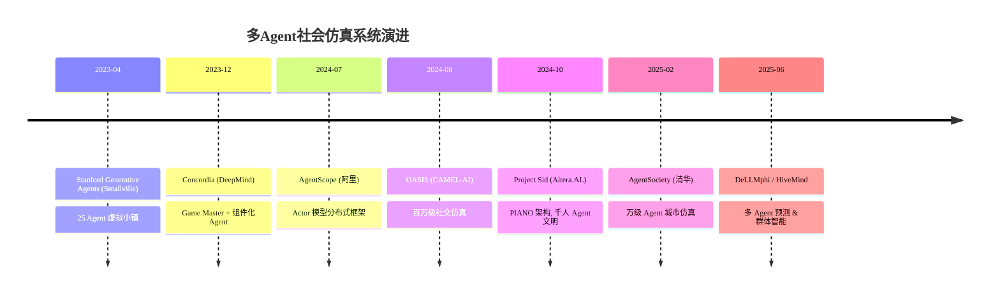

### 系统对比矩阵

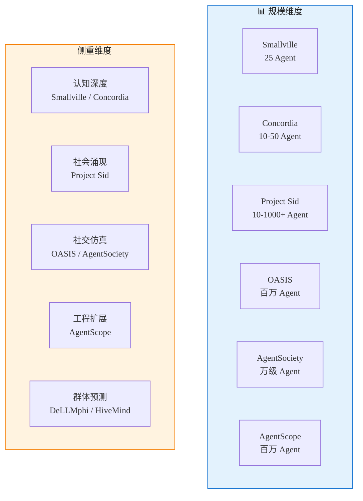

---

## 二、各系统详细解读

---

### 2.1 Stanford Generative Agents（Smallville）

> **论文**：*Generative Agents: Interactive Simulacra of Human Behavior* (2023)  
> **机构**：Stanford University + Google  
> **开源**：[GitHub](https://github.com/joonspk-research/generative_agents)

#### 架构图

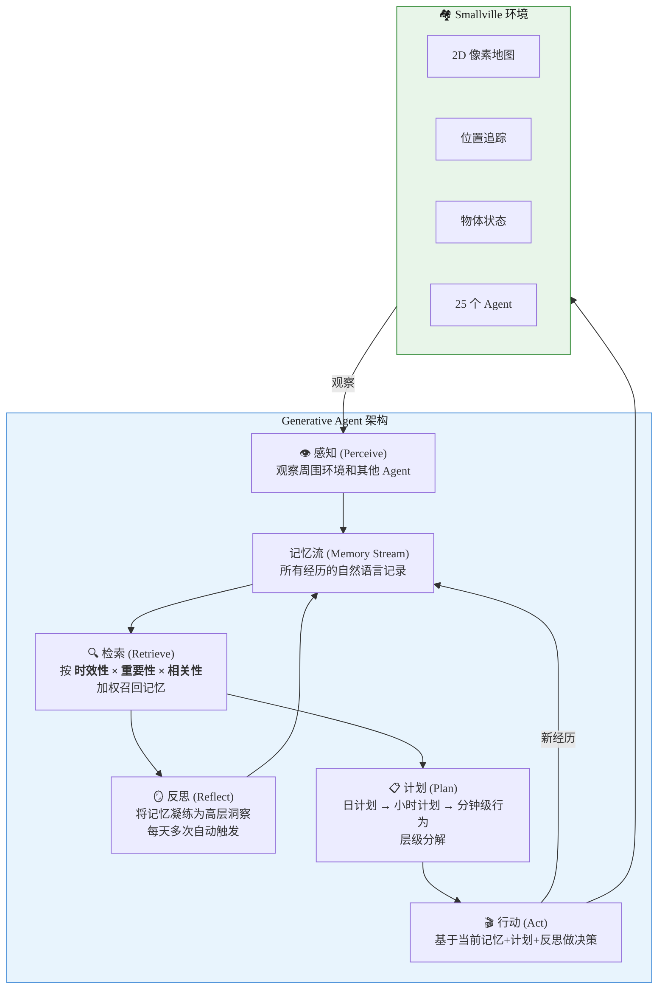

#### 核心创新

| 创新点 | 详细说明 |
|:------:|---------|
| **记忆流（Memory Stream）** | 所有经历以自然语言形式存入流式数据库，每条记忆附带时间戳、重要性评分，检索时用 `recency × importance × relevance` 三维加权 |
| **反思机制（Reflection）** | Agent 定期（非每步）从记忆中提炼高层次洞察，形成"关于关系的认知"和"关于自我的认知"，写回记忆流 |
| **层级计划（Hierarchical Planning）** | 日计划 → 小时计划 → 分钟级动作，计划可根据突发事件动态调整 |
| **涌现行为** | 仅给一个 Agent 说"办情人节派对"，整个社区自发传播邀请、形成关系、协调出席 |

#### 优缺点

| ✅ 优点 | ❌ 缺点 |
|---------|---------|
| 认知架构最完整，Agent 行为最像人 | 仅支持 25 个 Agent，无法扩展 |
| 反思机制产生真正的"涌现理解" | 每个 Agent 每步需多次 LLM 调用（感知+检索+计划+行动），成本极高 |
| 开创性论文，启发整个领域 | 串行执行，无分布式能力 |
| 人类评估中，Agent 行为比真人扮演更自然 | 环境过于简单（2D 格子世界） |

#### 对 MiroFish 的借鉴价值

- **记忆流 + 三维检索权重**：V1 的记忆依赖 Zep Cloud，缺乏结构化的重要性 + 时效性打分
- **反思机制**：Agent 不只是"做"，还会"想"——产生高阶认知，这对预测质量至关重要
- **层级计划**：让 Agent 有长期目标而非逐帧反应

---

### 2.2 Concordia（DeepMind）

> **论文**：*Generative agent-based modeling with actions grounded in physical, social, or digital space using Concordia* (2023)  
> **机构**：Google DeepMind  
> **开源**：[GitHub](https://github.com/google-deepmind/concordia) ⭐ 1,257

#### 架构图

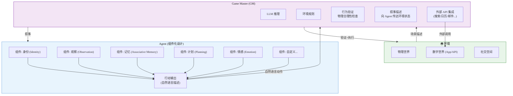

#### 核心创新

| 创新点 | 详细说明 |
|:------:|---------|
| **Game Master 模式** | 借鉴桌游，由一个特殊 Agent（GM）统一管理环境。Agent 用自然语言说"我想做什么"，GM 判断合理性并执行。这解耦了 Agent 和环境 |
| **组件化 Agent** | Agent 由可插拔组件组成（身份、记忆、观察、计划、情感…），两个核心操作：LLM 调用 + 联想记忆检索 |
| **三空间落地** | 同一架构适用于物理空间（检查物理合理性）、社交空间（人际互动）、数字空间（调 App API） |
| **研究友好** | 设计目标是给社会科学家用的 ABM 工具，而非工程产品 |

#### 优缺点

| ✅ 优点 | ❌ 缺点 |
|---------|---------|
| GM 模式优雅地解耦了 Agent 和环境 | 规模有限（论文中 10-50 Agent） |
| 组件化设计极易扩展，可随意添加/移除 Agent 认知模块 | GM 本身是瓶颈，每个 Agent 行动都需 GM 处理 |
| 支持物理/社交/数字三空间，通用性极强 | 无分布式支持 |
| Python 库设计，接口清晰 | 社区活跃度一般 |

#### 对 MiroFish 的借鉴价值

- **Game Master 模式**：用一个"仲裁者"管理仿真环境，验证 Agent 行为的合理性，比 Agent 直接操控环境更可控
- **组件化 Agent 设计**：让 Agent 的认知模块可插拔，便于实验不同的记忆/反思/计划策略

---

### 2.3 OASIS（CAMEL-AI）

> **论文**：*OASIS: Open Agent Social Interaction Simulations with One Million Agents* (2024)  
> **机构**：CAMEL-AI 社区  
> **开源**：[GitHub](https://github.com/camel-ai/oasis) ⭐ 3,132

#### 架构图

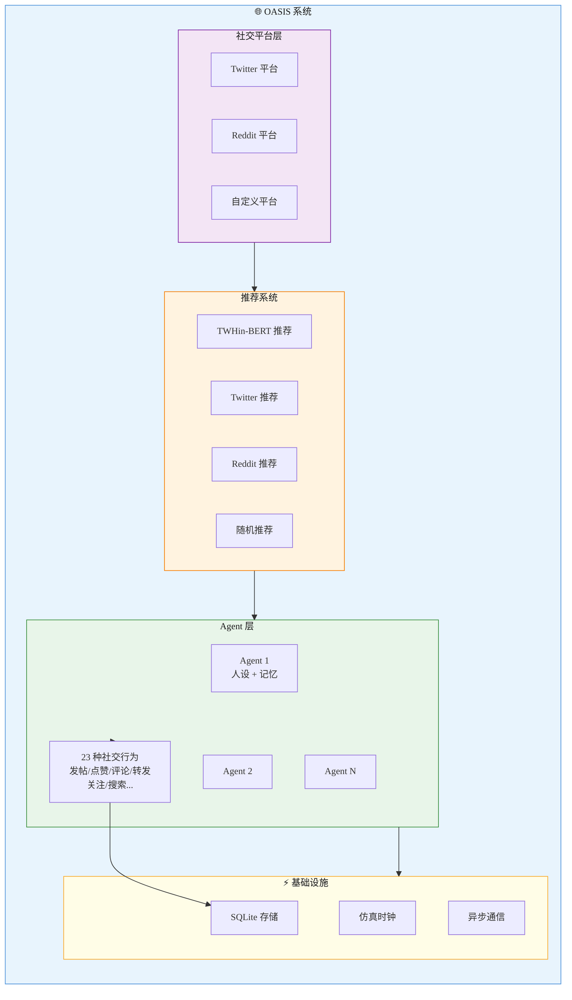

#### 核心创新

| 创新点 | 详细说明 |
|:------:|---------|
| **百万级 Agent** | 通过轻量化 Agent 设计，理论支持百万级仿真规模 |
| **真实推荐系统** | 集成 TWHin-BERT 等真实推荐算法，信息流不是随机的，而是按兴趣推荐 |
| **23 种行为** | 完整模拟社交平台操作：发帖、点赞、评论、转发、关注、搜索等 |
| **双平台** | 同时模拟 Twitter（即时动态）和 Reddit（主题论坛）两种社交模式 |
| **研究导向** | 专为研究信息传播、群体极化、从众行为等社会现象设计 |

#### 优缺点

| ✅ 优点 | ❌ 缺点 |
|---------|---------|
| 规模巨大，支持百万级 Agent | Agent 认知简单，无反思/计划等高阶机制 |
| 推荐系统真实，信息流有意义 | 环境固定为社交平台，不支持其他场景 |
| MiroFish V1 已在使用，团队熟悉 | 单机运行，扩展需手动管理 |
| 完善的行为日志和分析能力 | 缺乏 Agent 间的深度社会认知 |

#### 对 MiroFish 的借鉴价值

- **推荐系统**：V1 已用，V2 继续保留——信息流的真实性决定仿真质量
- **行为多样性**：23 种行为覆盖社交平台场景

---

### 2.4 Project Sid（Altera.AL）

> **论文**：*Project Sid: Many-agent simulations toward AI civilization* (arXiv:2411.00114, 2024)  
> **机构**：Altera.AL  
> **开源**：[GitHub](https://github.com/altera-al/project-sid) ⭐ 1,253

#### PIANO 架构图

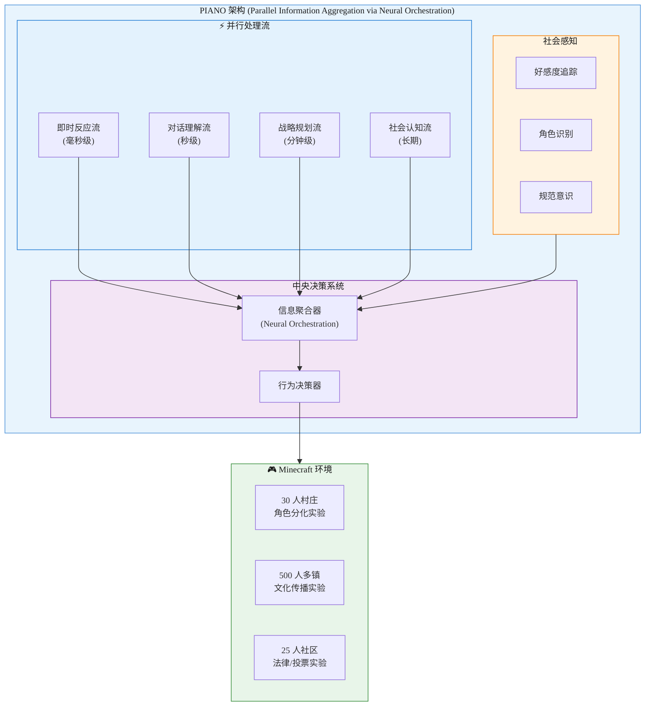

#### 核心创新

| 创新点 | 详细说明 |
|:------:|---------|
| **多时间尺度并行认知** | 人类同时处理即时反应和长期规划，PIANO 用并行流模拟这一能力，而非串行 function call |
| **社会感知驱动涌现** | 限制 Agent 社会感知 → 行为趋同；开放社会感知 → 角色自发分化。证明社会感知是涌现的关键 |
| **文明级实验** | 职业分化（30 Agent）、民主立法（25 Agent）、文化/宗教传播（500 Agent）三大文明实验 |
| **实时交互** | Agent 在 Minecraft 实时环境中运行，需即时响应 |

#### 涌现现象案例

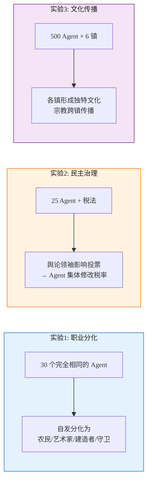

#### 优缺点

| ✅ 优点 | ❌ 缺点 |
|---------|---------|
| 唯一验证了千人级"文明涌现"的系统 | 架构复杂度极高，工程实现难度大 |
| 多时间尺度并行认知，最接近人类认知 | 依赖 Minecraft 实时环境，非通用 |
| 实验证明"社会感知"是涌现关键 | 未开源核心 PIANO 实现 |
| 涌现现象丰富（职业/法律/文化/宗教） | LLM 调用量巨大，成本极高 |

#### 对 MiroFish 的借鉴价值

- **社会感知机制**：Agent 需要感知其他 Agent 的态度/影响力/声誉，才能产生真正的涌现
- **多时间尺度认知**：Agent 同时维护"即时反应"和"长期策略"两个认知层次
- **涌现是系统目标，不是副产品**：设计架构时要为涌现创造条件（社会感知 + 足够自由度）

---

### 2.5 AgentSociety（清华大学）

> **论文**：*AgentSociety: Large-Scale Simulation of LLM-Driven Generative Agents* (arXiv:2502.08691, 2025)  
> **机构**：清华大学 FIB Lab  
> **开源**：[GitHub](https://github.com/tsinghua-fib-lab/AgentSociety) | [文档](https://agentsociety.readthedocs.io)

#### Agent-Block-Action 架构图

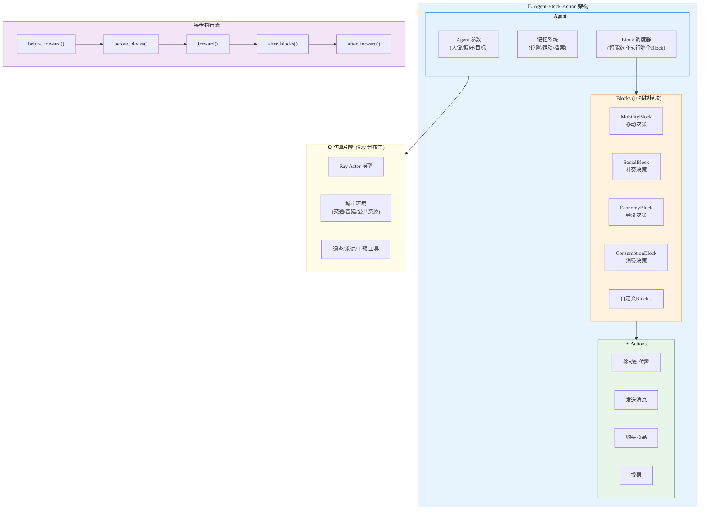

#### 核心创新

| 创新点 | 详细说明 |
|:------:|---------|
| **Agent-Block-Action 模式** | Agent 是容器，Block 是可插拔能力模块，Action 是具体操作。类似微服务中的插件模式，极大提升可扩展性 |
| **Ray 分布式引擎** | 基于 Ray Actor 模型，异步调度万级 Agent，天然支持水平扩展 |
| **城市级仿真** | 不限于社交平台，模拟完整城市环境（交通、基建、公共资源） |
| **研究工具链** | 内置调查、采访、干预等社会科学研究方法，可以在仿真中做"实验" |
| **大规模验证** | 1 万+ Agent，500 万次交互，四大社会议题（极化、谣言、UBI、飓风）的实验结果与真实世界一致 |

#### 优缺点

| ✅ 优点 | ❌ 缺点 |
|---------|---------|
| Agent-Block-Action 架构设计精妙，可扩展性最强 | 架构复杂，学习曲线较陡 |
| Ray 分布式，真正可水平扩展 | 依赖 Ray 集群，部署成本较高 |
| 研究工具链完整（调查/采访/干预） | 城市仿真场景可能过于复杂 |
| 实验验证充分，结果可信 | Agent 认知深度不如 Smallville |

#### 对 MiroFish 的借鉴价值

- **Agent-Block-Action 模式**：将 Agent 的各种能力（记忆、社交、经济、移动）模块化，MiroFish V2 可以用类似模式让 Agent 的"预测相关能力"可插拔
- **研究工具链**：内置调查/采访/干预能力，正是 MiroFish "深度互动"步骤所需
- **Ray 分布式参考**：虽然 MiroFish 当前规模不需要 Ray，但 Actor 模型的思想可用于 Go goroutine 编排

---

### 2.6 AgentScope（阿里 ModelScope）

> **论文**：*Very Large-Scale Multi-Agent Simulation in AgentScope* (arXiv:2407.17789, 2024)  
> **机构**：阿里巴巴  
> **开源**：[GitHub](https://github.com/modelscope/agentscope) ⭐ 18,138

#### 核心架构

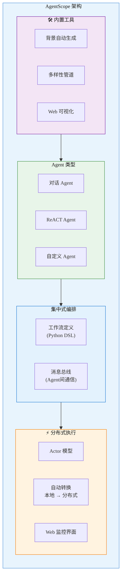

#### 核心创新

| 创新点 | 详细说明 |
|:------:|---------|
| **集中编排 + 分布式执行** | 用 Python DSL 定义工作流，运行时自动转换为分布式 Actor |
| **Agent 多样性管道** | 自动化的人设生成管道，让大规模 Agent 拥有差异化背景 |
| **Web 监控** | 内置 Web 界面监控大量 Agent 运行状态 |
| **百万级扩展** | 论文验证了百万级 Agent 的可行性 |

#### 优缺点

| ✅ 优点 | ❌ 缺点 |
|---------|---------|
| 工程质量最高（⭐ 18k），社区最活跃 | 定位为通用框架，社会仿真不是首要目标 |
| 集中编排 + 分布式执行的设计最优雅 | 缺乏内置推荐系统等社交仿真组件 |
| Agent 多样性自动生成 | Agent 认知模型较基础 |
| Web 监控方便调试 | 国内文档为主，国际化一般 |

#### 对 MiroFish 的借鉴价值

- **集中编排思想**：Go 后端作为"编排器"控制全局流程，Agent 分布式执行——与 MiroFish V1 的设计吻合
- **Agent 多样性管道**：V2 需要更好的自动化人设生成
- **Web 监控**：实时查看仿真中 Agent 的状态

---

### 2.7 DeLLMphi / 群体预测方法

> **论文**：*DeLLMphi: A Multi-Turn Method for Multi-Agent Forecasting* (NeurIPS 2025 Workshop)  
> **相关**：*The Wisdom of Deliberating AI Crowds* (arXiv:2512.22625)、*Society of HiveMind* (arXiv:2503.05473)

#### 架构图

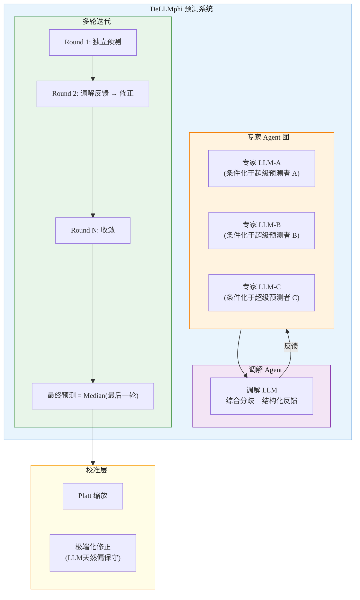

#### 核心创新

| 创新点 | 详细说明 |
|:------:|---------|
| **数字化德尔菲法** | 把经典的专家多轮讨论法（Delphi Method）用 LLM 复现，将数月过程压缩到分钟 |
| **超级预测者条件化** | 专家 LLM 不是泛泛回答，而是先学习真实超级预测者的推理模式，再做预测 |
| **调解者架构** | 专门的调解 Agent 识别分歧点、综合推理链路、提供结构化反馈 |
| **多模型多样性** | 研究发现：不同 LLM 模型组成的"专家团"效果远好于同一模型多次运行 |
| **统计校准** | LLM 天然"保守"（偏向50%），Platt 缩放 + 极端化修正可纠正这一偏差 |

#### 优缺点

| ✅ 优点 | ❌ 缺点 |
|---------|---------|
| 专为"预测"场景设计，与 MiroFish 目标最匹配 | 需要多个不同的 LLM 模型（多样性是关键） |
| 多轮迭代 + 调解者 = 更准确的预测 | 仅适用于概率预测，不含社会仿真 |
| 统计校准技术成熟 | 单独使用质量有限，需结合其他信息源 |
| 成本可控（每个问题 3-5 Agent × 3-5 轮） | 对"黑天鹅"事件预测能力有限 |

#### 对 MiroFish 的借鉴价值

- **仿真后的"预测精炼"**：仿真输出 → 多 Agent 德尔菲法讨论 → 校准后的最终预测。这是 V1 缺失的关键环节
- **统计校准**：不信任 LLM 原始概率，用数学方法矫正
- **调解者角色**：等价于 MiroFish 的 ReportAgent，但增加了多轮迭代和分歧识别能力

---

## 三、综合对比

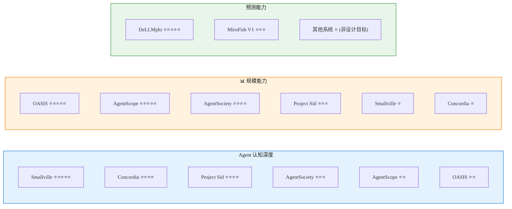

### 关键维度对比表

| 系统 | 规模 | 认知深度 | 环境类型 | 分布式 | 预测能力 | 开源质量 |
|:----:|:----:|:-------:|:-------:|:-----:|:-------:|:-------:|
| **Smallville** | 25 | ⭐⭐⭐⭐⭐ | 2D 小镇 | ❌ | ❌ | ⭐⭐ |
| **Concordia** | ~50 | ⭐⭐⭐⭐ | 通用(物理/数字/社交) | ❌ | ❌ | ⭐⭐⭐ |
| **OASIS** | 百万 | ⭐⭐ | 社交平台 | ❌ | ❌ | ⭐⭐⭐ |
| **Project Sid** | 1000+ | ⭐⭐⭐⭐ | Minecraft | 部分 | ❌ | ⭐ |
| **AgentSociety** | 万级 | ⭐⭐⭐ | 城市 | ✅ Ray | ❌ | ⭐⭐⭐⭐ |
| **AgentScope** | 百万 | ⭐⭐ | 通用 | ✅ Actor | ❌ | ⭐⭐⭐⭐⭐ |
| **DeLLMphi** | N/A | N/A | N/A | ❌ | ⭐⭐⭐⭐⭐ | ⭐⭐ |
| **MiroFish V1** | ~30 | ⭐⭐ | 社交平台 | ❌ | ⭐⭐⭐ | — |

---

## 四、对 MiroFish V2 的启示

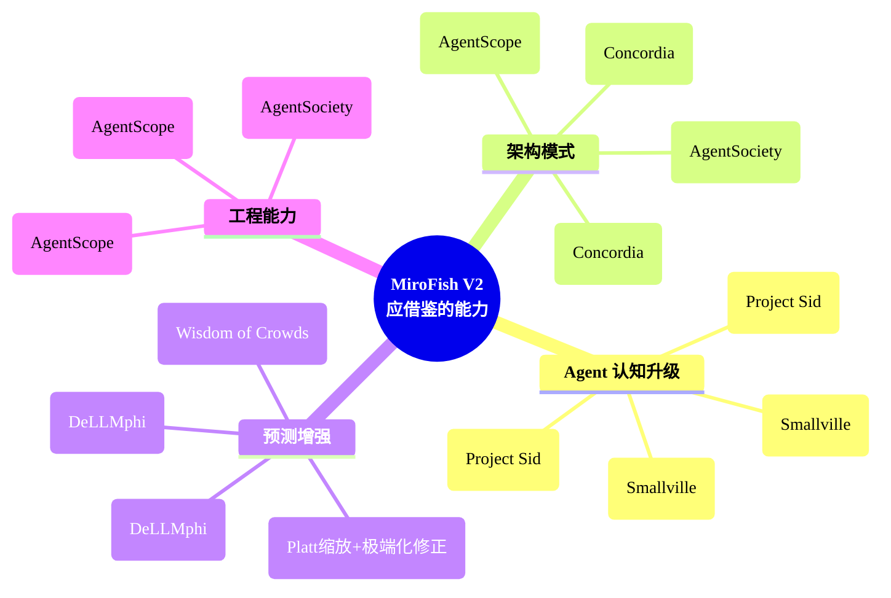

### V1 → V2 需要弥补的核心差距

| # | 差距 | V1 现状 | 业界最佳实践 | V2 目标 |
|:-:|------|---------|------------|---------|
| 1 | **Agent 认知浅** | 简单 Prompt 驱动，无记忆/反思/计划 | Smallville 记忆流+反思 | 三层认知（记忆+反思+计划） |
| 2 | **缺乏社会感知** | Agent 不知道其他 Agent 的态度/影响力 | Project Sid 社会感知驱动涌现 | Agent 间声誉/影响力追踪 |
| 3 | **无预测精炼** | 仿真 → 直接出报告 | DeLLMphi 多轮德尔菲法 | 仿真 → 预测精炼 → 校准 → 报告 |
| 4 | **环境无仲裁** | Agent 直接操控平台 | Concordia Game Master | 引入 GM 验证行为合理性 |
| 5 | **模块不可插拔** | 硬编码流程 | AgentSociety Block 模式 | 可插拔 Block 架构 |
