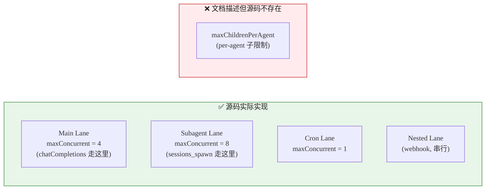
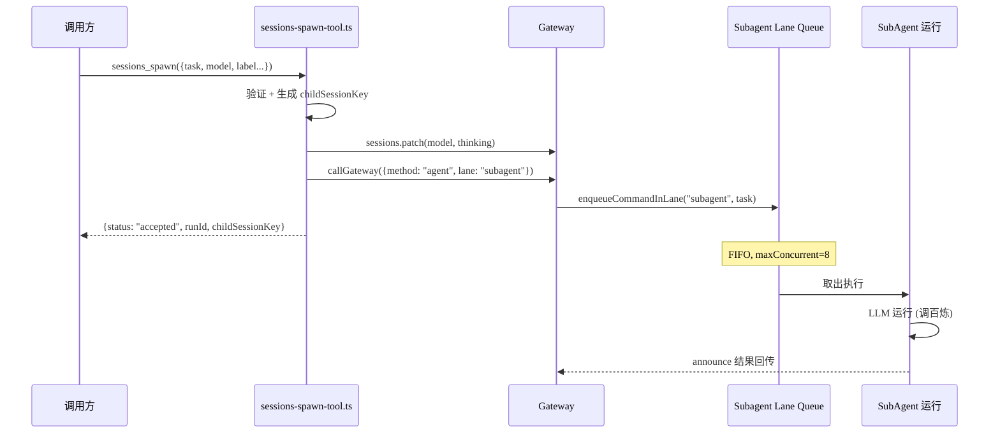
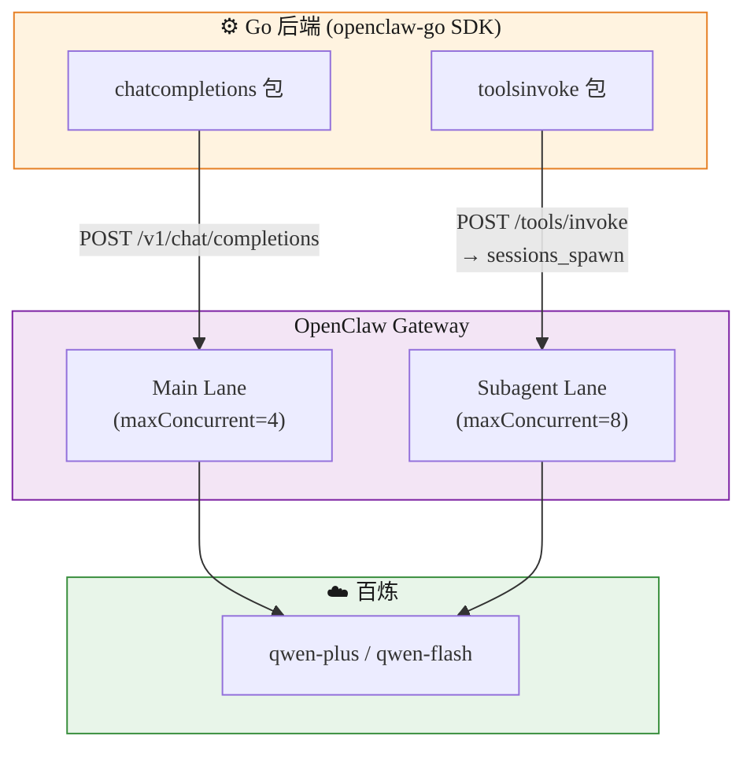
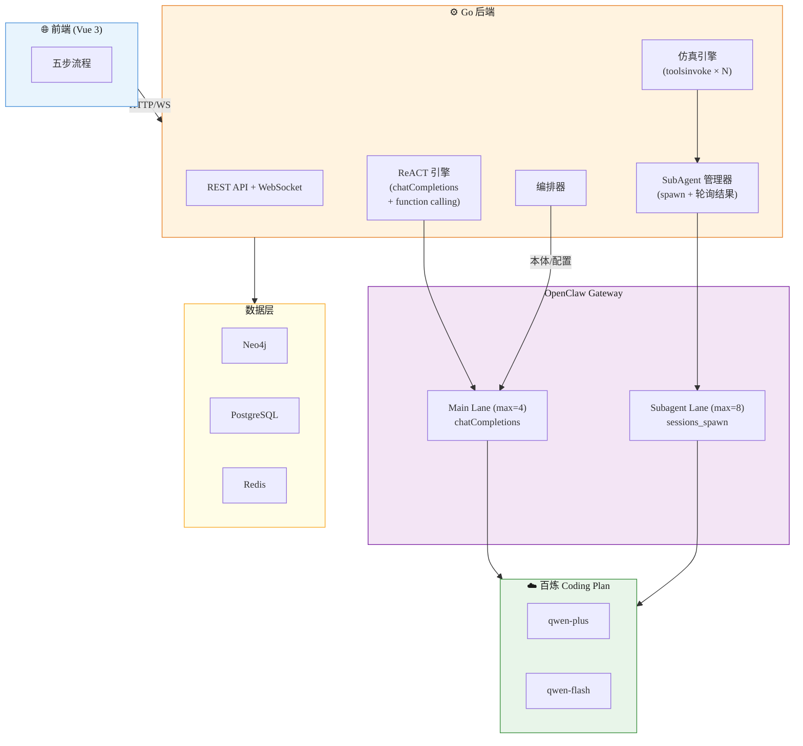
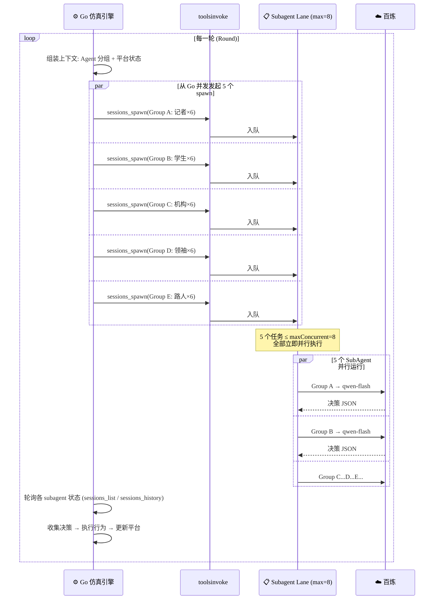
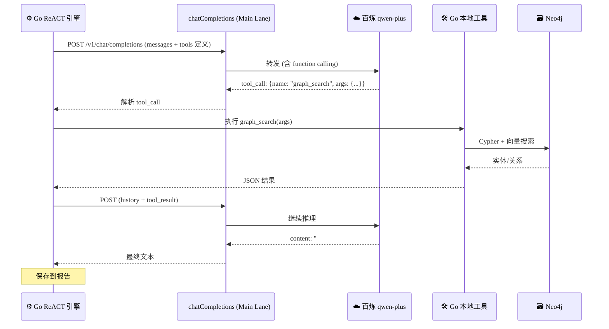
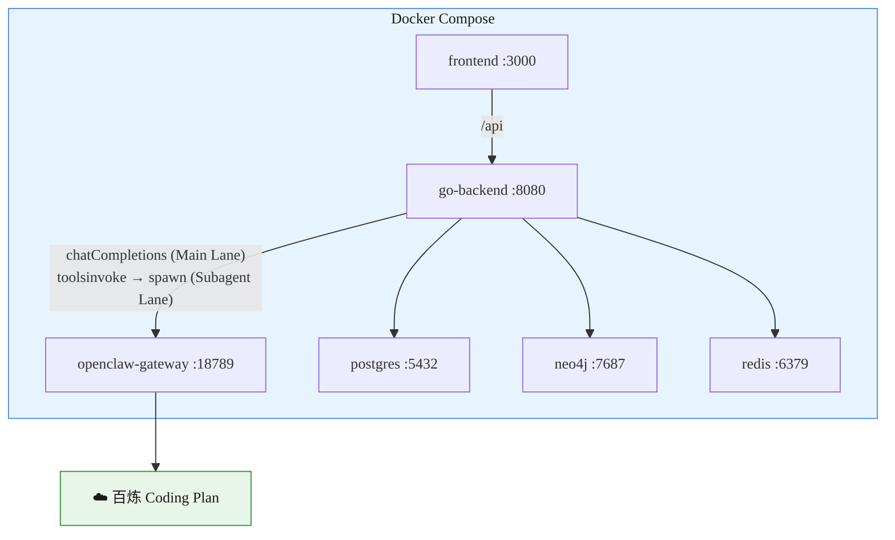
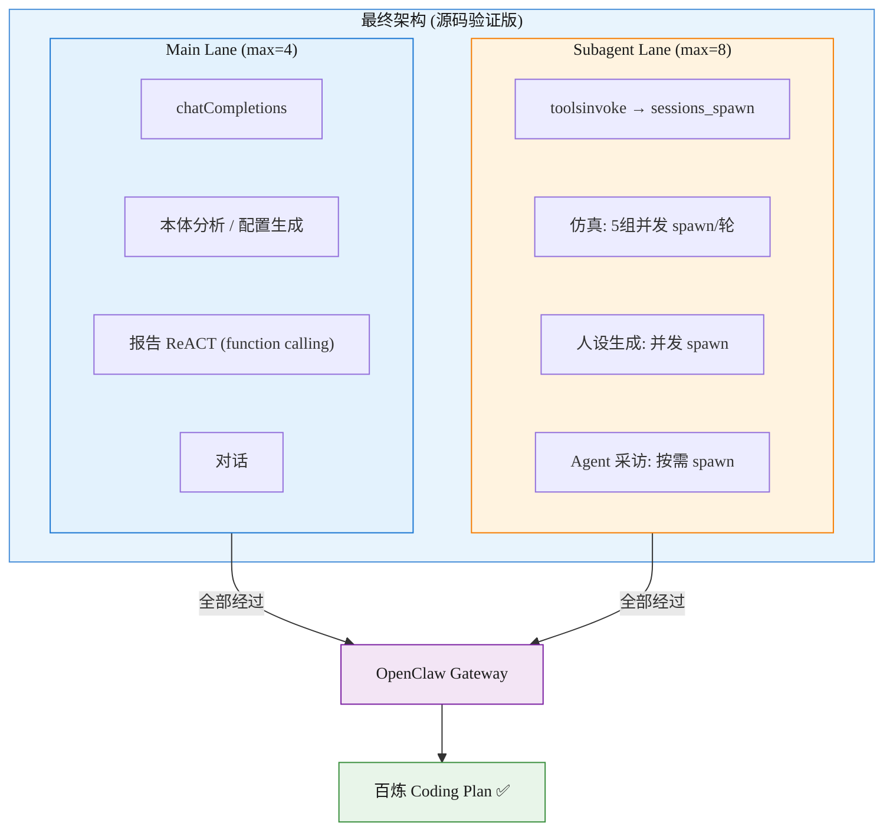

# MiroFish 应用场景 & Go + OpenClaw 设计方案（源码验证版）

> 本文档基于 OpenClaw 源码（`/Users/huaquan.liang/Documents/GitHub/openclaw`）实际分析，修正了之前基于文档的多处假设。

---

## 第一部分：约束条件

| 约束 | 说明 |
|------|------|
| 百炼 Coding Plan | 禁止后端直接调 API，只能通过 OpenClaw 等授权工具 |
| 所有 LLM 调用 | **必须经过 OpenClaw Gateway 内部** |

---

## 第二部分：源码验证 — 与文档的关键差异

### 2.1 并发模型（源码 vs 文档）



**源码位置：**
- Lane 定义：`src/process/lanes.ts` → `CommandLane` enum
- 并发设置：`src/gateway/server-lanes.ts` → `applyGatewayLaneConcurrency()`
- 队列实现：`src/process/command-queue.ts` → per-lane FIFO + maxConcurrent

**关键结论：并发控制是全局 per-lane，不是 per-agent。没有 `maxChildrenPerAgent` 限制。**

### 2.2 批量 Agent 机制（源码实际情况）

| 机制 | 在源码中？ | 说明 |
|:---:|:---:|------|
| **OpenProse** | ✅ 内置 | `extensions/open-prose/`，声明式 Agent 编排 VM |
| `openclaw-workflow` | ❌ **不在源码** | 第三方社区插件，非内置 |
| `sessions_spawn_barrier` | ❌ 不存在 | GitHub 提案，未实现 |
| `sessions_spawn` | ✅ 核心 | `src/agents/tools/sessions-spawn-tool.ts` |

### 2.3 OpenProse — 源码中的批量并行机制

OpenProse 是 OpenClaw 内置的声明式 Agent 编排语言。关键能力：

```prose
# 并行执行：同时 spawn 多个 subagent
parallel:
  a = session "Task A"
  b = session "Task B"
  c = session "Task C"

# 并行 for-each：对集合中每项并发处理
parallel for item in items:
  session "Process {item}"

# 循环 + 条件
loop until **任务完成** (max: 10):
  session "执行一轮"

# 重试
session "可能失败的操作" (retry: 3)
```

**但 OpenProse 的代价：** 主 Agent 作为"VM"执行 `.prose` 程序，**VM 本身消耗 token**。每次 VM 解析和调度都是一次 LLM 调用。

### 2.4 sessions_spawn 源码实现



**源码关键：**
- `sessions_spawn` 非阻塞，立即返回 `runId`
- 子任务入 Subagent Lane 的 FIFO 队列
- 队列按 `maxConcurrent`（默认 8）并发消费
- 无 per-agent 子数量限制（这点与文档不同）

### 2.5 两个 HTTP 端点的 Lane 分配

| 端点 | 源码文件 | Lane | maxConcurrent |
|:---:|:---:|:---:|:---:|
| `POST /v1/chat/completions` | `src/gateway/openai-http.ts` | **Main** | 4 |
| `POST /tools/invoke` | `src/gateway/tools-invoke-http.ts` | 取决于被调工具 | — |
| ↳ 调 `sessions_spawn` | — | **Subagent** | 8 |

**重要发现：chatCompletions 走 Main Lane（maxConcurrent=4），而 sessions_spawn 走 Subagent Lane（maxConcurrent=8）。对于并发场景，sessions_spawn 更合适。**

---

## 第三部分：推荐架构

### 3.1 三条可用路径（源码确认）



### 3.2 各步骤路径分配

| 步骤 | 操作 | 路径 | Lane | 原因 |
|:---:|------|:---:|:---:|------|
| 1 | 本体分析 | chatCompletions | Main | 单次调用，不需要并发 |
| 1 | 图谱构建 | Go → Neo4j | — | 纯代码 |
| 2 | 人设生成 ×N | **toolsinvoke → sessions_spawn ×N** | **Subagent** | 需并发（最多 8 个同时） |
| 2 | 配置生成 | chatCompletions | Main | 单次 |
| 3 | **仿真 ×R 轮** | **toolsinvoke → sessions_spawn ×5/轮** | **Subagent** | 分组并发，每轮 5 组 |
| 4 | 报告 ReACT | chatCompletions + function calling | Main | Go 管理 tool 循环 |
| 5 | 对话 | chatCompletions | Main | 多轮对话 |
| 5 | Agent 采访 | toolsinvoke → sessions_spawn | Subagent | 独立 agent 会话 |

### 3.3 架构总览



---

## 第四部分：仿真引擎详细设计

### 4.1 仿真流程



### 4.2 为什么这样分组

| 方案 | spawn/轮 | 占 Subagent Lane | 可行性 |
|:---:|:---:|:---:|:---:|
| 每 Agent 1 个 spawn | 30 | 30 > 8，排队严重 | ⚠️ 可行但慢 |
| **每组 6 Agent = 5 spawn** | **5** | **5 ≤ 8，全部并行** | **✅ 最优** |
| 全 Agent 1 个 spawn | 1 | 1 ≤ 8 | ✅ 但质量低 |

**推荐：每组 5-8 个 Agent，分 4-6 组。**
因为源码确认**无 per-agent 子数量限制**，只有全局 lane 限制（默认 8），所以 5 组完全可以全部并行。

### 4.3 核心代码

```go
// internal/simulation/engine.go

type SimulationEngine struct {
    ti       *toolsinvoke.Client
    platform *Platform
    logger   *ActionLogger
}

func (e *SimulationEngine) RunRound(ctx context.Context, round int, agents []AgentProfile) error {
    groups := groupAgents(agents, 6)
    feed := e.platform.GetFeed(round)

    // 1. 并发 spawn 所有组（从 Go goroutine 发起，全部非阻塞）
    type spawnResult struct {
        groupIdx int
        runID    string
        err      error
    }
    results := make(chan spawnResult, len(groups))

    for i, group := range groups {
        go func() {
            resp, err := e.ti.Invoke(ctx, toolsinvoke.Request{
                Tool: "sessions_spawn",
                Args: map[string]any{
                    "task":              buildGroupPrompt(group, feed, round),
                    "model":             "dashscope:qwen-flash",
                    "label":             fmt.Sprintf("sim-r%d-g%d", round, i),
                    "runTimeoutSeconds": 120,
                    "deliver":           true,
                },
            })
            runID := ""
            if err == nil {
                runID = parseRunID(resp.Result)
            }
            results <- spawnResult{i, runID, err}
        }()
    }

    // 2. 收集所有 runID
    runIDs := make(map[int]string)
    for range groups {
        r := <-results
        if r.err != nil {
            return fmt.Errorf("spawn group %d: %w", r.groupIdx, r.err)
        }
        runIDs[r.groupIdx] = r.runID
    }

    // 3. 轮询等待所有 subagent 完成
    allDecisions, err := e.waitAndCollect(ctx, runIDs)
    if err != nil {
        return err
    }

    // 4. 执行行为 + 更新平台
    for _, d := range allDecisions {
        e.platform.Execute(d)
        e.logger.Log(round, d)
    }
    return nil
}

func (e *SimulationEngine) waitAndCollect(ctx context.Context, runIDs map[int]string) ([]Decision, error) {
    // 通过 toolsinvoke 调 sessions_list 或轮询 announce 结果
    // subagent 完成后 announce 回传结果
    // ...
}
```

### 4.4 调用量分析

| 步骤 | 路径 | Lane | 调用次数 |
|:---:|:---:|:---:|:---:|
| 本体分析 | chatCompletions | Main | 1 |
| 人设生成 (30 Agent / 6组) | sessions_spawn ×5 | Subagent | 5 |
| 配置生成 | chatCompletions | Main | 1 |
| 仿真 40轮 ×5组 | sessions_spawn ×5/轮 | Subagent | **200** |
| 报告 ReACT | chatCompletions ×~20 | Main | ~20 |
| 对话/采访 | 混合 | 混合 | ~10 |
| **总计** | | | **~237** |

Pro 套餐 5 小时 6000 次 → 237 次仅占 **4%**，完全安全。

---

## 第五部分：ReACT 报告引擎

通过 chatCompletions 端点 + 百炼原生 function calling，Go 管理 tool 循环。



---

## 第六部分：OpenProse 的可选用法

OpenProse 是源码内置的声明式编排方案。如果未来需要更复杂的 Agent 编排（如多轮迭代、条件分支），可以用 `.prose` 程序替代 Go 硬编码。

**示例：仿真一轮**

```prose
agent sim-group:
  model: qwen-flash
  prompt: "你是一组社交媒体用户，根据人设和信息流做出行为决策"

# 并行执行 5 个分组
parallel:
  a = session: sim-group
    prompt: "{group_a_prompt}"
  b = session: sim-group
    prompt: "{group_b_prompt}"
  c = session: sim-group
    prompt: "{group_c_prompt}"
  d = session: sim-group
    prompt: "{group_d_prompt}"
  e = session: sim-group
    prompt: "{group_e_prompt}"

output results = session "合并所有组的决策结果"
  context: { a, b, c, d, e }
```

**代价：** OpenProse 运行需要一个主 Agent 作为"VM"，**VM 本身会消耗 token**（解析+调度开销）。对于当前场景，直接用 `toolsinvoke → sessions_spawn` 更轻量。

**建议：** 当前用 `toolsinvoke` 硬编码编排，未来需要动态工作流时再引入 OpenProse。

---

## 第七部分：OpenClaw Gateway 配置

```jsonc
{
  "models": {
    "providers": {
      "dashscope": {
        "baseUrl": "https://dashscope.aliyuncs.com/compatible-mode/v1",
        "apiKey": { "source": "env", "id": "BAILIAN_CODING_PLAN_KEY" },
        "api": "openai-completions",
        "models": [
          { "id": "qwen-plus", "name": "Qwen Plus" },
          { "id": "qwen-flash", "name": "Qwen Flash" }
        ]
      }
    },
    "default": "dashscope:qwen-plus"
  },
  "agents": {
    "defaults": {
      "model": "dashscope:qwen-plus",
      "maxConcurrent": 4,
      "subagents": {
        "maxConcurrent": 8,
        "maxSpawnDepth": 1,
        "runTimeoutSeconds": 300,
        "archiveAfterMinutes": 15,
        "model": "dashscope:qwen-flash"
      }
    }
  },
  "gateway": {
    "http": {
      "endpoints": {
        "chatCompletions": { "enabled": true }
      }
    }
  }
}
```

---

## 第八部分：项目结构 & 部署

### 目录结构

```
swarm-predict/
├── cmd/server/main.go
├── internal/
│   ├── api/                          # HTTP Handler
│   │   ├── router.go
│   │   ├── graph_handler.go
│   │   ├── simulation_handler.go
│   │   └── report_handler.go
│   ├── openclaw/                     # OpenClaw 客户端
│   │   ├── clients.go                # CC + TI 客户端
│   │   ├── spawner.go                # sessions_spawn 封装
│   │   └── poller.go                 # subagent 结果轮询
│   ├── simulation/                   # 仿真引擎
│   │   ├── engine.go                 # spawn 编排
│   │   ├── grouper.go               # Agent 分组策略
│   │   ├── platform.go              # 虚拟社交平台
│   │   ├── feed.go                  # 信息流引擎
│   │   ├── memory.go                # 记忆管理
│   │   └── logger.go
│   ├── react/                        # ReACT 引擎
│   │   ├── engine.go                 # function calling loop
│   │   ├── tools.go                  # 工具注册
│   │   └── report.go
│   ├── graph/                        # Neo4j 图谱
│   ├── model/
│   └── store/
├── configs/openclaw.json
├── go.mod
└── docker-compose.yml
```

### 部署



---

## 第九部分：总结



| 维度 | 值 |
|------|------|
| **全部 LLM 调用** | 通过 OpenClaw Gateway → 百炼 Coding Plan ✅ |
| **仿真策略** | `toolsinvoke → sessions_spawn` × 5 组/轮, Subagent Lane 并发 |
| **仿真并发** | 5 组 ≤ maxConcurrent=8（源码确认无 per-agent 限制） |
| **报告 ReACT** | chatCompletions + function calling, Go 管理 tool 循环 |
| **单次仿真调用** | ~237 次 (Pro 5h 额度 6000, 仅占 4%) |
| **OpenProse** | 内置可选，未来复杂编排时引入 |
| **Go SDK** | `openclaw-go` (chatcompletions + toolsinvoke) |
