# MiroFish V2 设计方案

> **核心升级**：从"简单仿真 + 出报告"进化为"深度认知仿真 + 群体预测精炼"  
> **设计原则**：借鉴 Smallville（认知深度）、Project Sid（社会感知）、Concordia（GM 仲裁）、AgentSociety（模块化）、DeLLMphi（预测精炼）  
> **技术栈**：Go + OpenClaw Gateway + 百炼 Coding Plan（约束不变）

---

## 一、V1 vs V2 核心差异

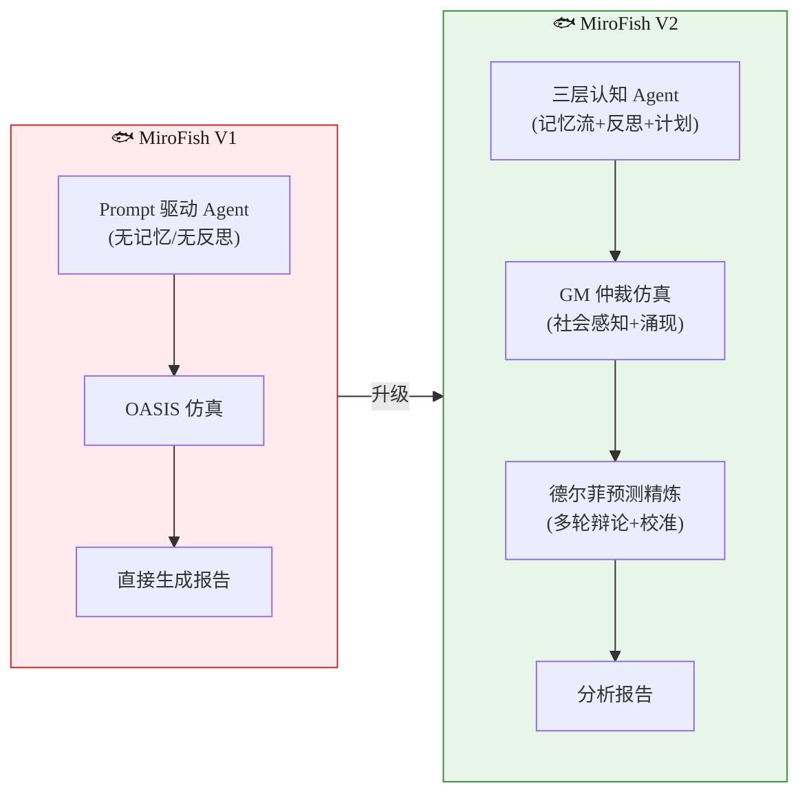

| 维度 | V1 | V2 | 借鉴来源 |
|:----:|:---:|:---:|:--------:|
| Agent 认知 | 单次 Prompt 决策 | 记忆流 + 反思 + 层级计划 | Smallville |
| 社会动力 | Agent 独立行动 | 声誉/影响力/好感度追踪 | Project Sid |
| 环境管理 | Agent 直接操控平台 | Game Master 仲裁 + 合理性检查 | Concordia |
| Agent 架构 | 硬编码 | Agent-Block-Action 可插拔 | AgentSociety |
| 预测输出 | 仿真 → 报告 | 仿真 → 德尔菲精炼 → 校准 → 报告 | DeLLMphi |
| 报告质量 | 单次 ReACT 生成 | 多视角辩论 + 统计校准 | Wisdom of Crowds |

---

## 二、总体架构

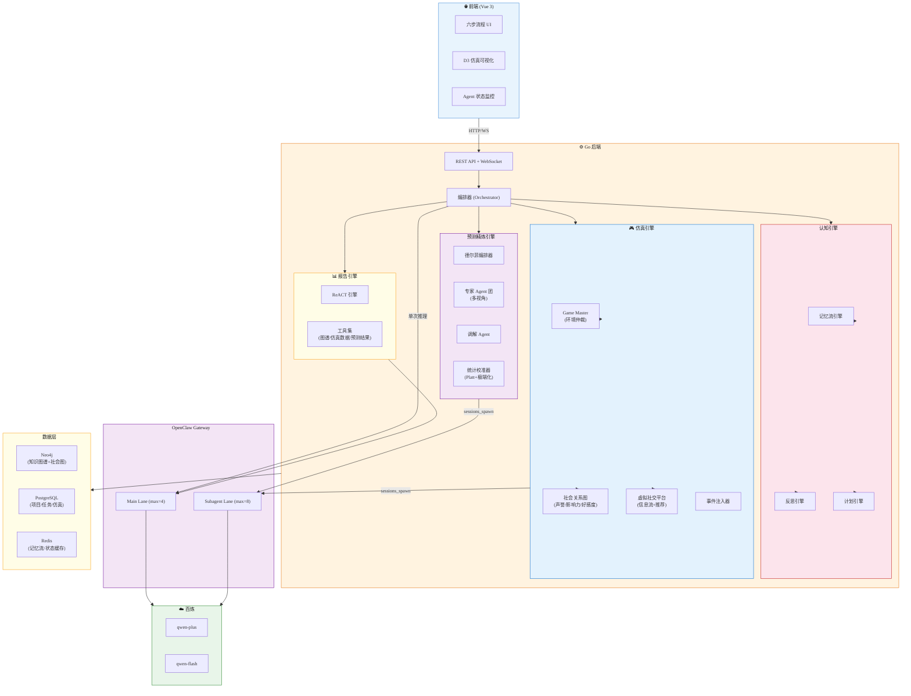

---

## 三、六步工作流（V1 五步 → V2 六步）

```mermaid
%%{init: {'theme': 'default', 'themeVariables': {'fontSize': '14px', 'fontFamily': 'Arial Black'}}}%%
flowchart LR
    A["📄 Step 1<br/><b>图谱构建</b>"]
    B["🏗️ Step 2<br/><b>环境搭建</b>"]
    C["🚀 Step 3<br/><b>社会仿真</b>"]
    D["🔮 Step 4<br/><b>预测精炼</b><br/>(新增)"]
    E["📊 Step 5<br/><b>报告生成</b>"]
    F["💬 Step 6<br/><b>深度互动</b>"]

    A -->|"本体+图谱"| B
    B -->|"认知Agent+配置"| C
    C -->|"仿真数据+涌现信号"| D
    D -->|"精炼预测+置信度"| E
    E -->|"ReACT报告"| F

    style A fill:#E3F2FD,stroke:#1976D2,color:#1a1a1a
    style B fill:#E8F5E9,stroke:#388E3C,color:#1a1a1a
    style C fill:#FFF3E0,stroke:#F57C00,color:#1a1a1a
    style D fill:#F3E5F5,stroke:#7B1FA2,color:#1a1a1a
    style E fill:#FCE4EC,stroke:#C62828,color:#1a1a1a
    style F fill:#FFFDE7,stroke:#F9A825,color:#1a1a1a
```

**新增 Step 4（预测精炼）**：这是 V2 最重要的升级。仿真输出的原始行为数据需经过"德尔菲式"多 Agent 辩论和统计校准，才能生成高质量预测。

---

## 四、Agent 认知架构（核心升级 1）

### 4.1 三层认知模型

借鉴 Smallville 的记忆流 + 反思 + 计划，并加入 Project Sid 的社会感知，构建 V2 的 Agent 认知模型：

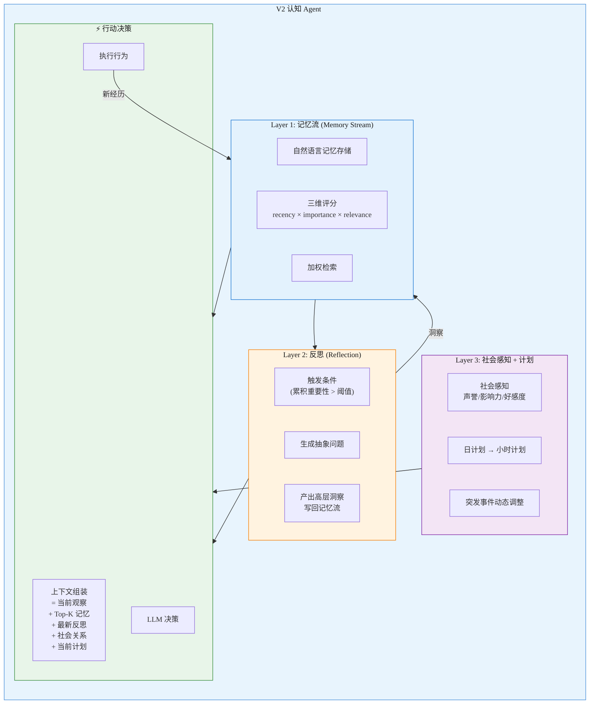

### 4.2 记忆流实现

```go
// internal/cognitive/memory.go

type MemoryEntry struct {
    ID         string    `json:"id"`
    AgentID    string    `json:"agent_id"`
    Content    string    `json:"content"`
    Timestamp  time.Time `json:"timestamp"`
    Importance float64   `json:"importance"`
    Kind       string    `json:"kind"` // "observation" | "action" | "reflection" | "plan"
    Embedding  []float32 `json:"embedding,omitempty"`
}

type MemoryStream struct {
    store   MemoryStore     // Redis sorted set (by timestamp)
    embedder EmbeddingClient // 向量化
}

func (ms *MemoryStream) Retrieve(ctx context.Context, query string, k int) ([]MemoryEntry, error) {
    now := time.Now()
    candidates := ms.store.GetRecent(ctx, ms.agentID, 100)
    queryEmb := ms.embedder.Embed(ctx, query)

    scored := make([]scoredEntry, len(candidates))
    for i, entry := range candidates {
        recency := exponentialDecay(now.Sub(entry.Timestamp), decayRate)
        relevance := cosineSimilarity(queryEmb, entry.Embedding)
        importance := entry.Importance
        scored[i] = scoredEntry{
            entry: entry,
            score: recency*wRecency + relevance*wRelevance + importance*wImportance,
        }
    }

    sort.Slice(scored, func(i, j int) bool { return scored[i].score > scored[j].score })
    return top(scored, k), nil
}
```

### 4.3 反思机制

```go
// internal/cognitive/reflection.go

type ReflectionEngine struct {
    cc       *chatcompletions.Client
    memStore MemoryStore
}

func (r *ReflectionEngine) MaybeReflect(ctx context.Context, agent *Agent) error {
    recentMemories := r.memStore.GetSince(ctx, agent.ID, agent.LastReflectionTime)
    totalImportance := sumImportance(recentMemories)

    if totalImportance < reflectionThreshold {
        return nil // 不需要反思
    }

    // Step 1: 从近期记忆生成高层问题
    questions, _ := r.cc.Complete(ctx, chatcompletions.Request{
        Messages: []Message{
            {Role: "system", Content: reflectionQuestionPrompt},
            {Role: "user", Content: formatMemories(recentMemories)},
        },
    })

    // Step 2: 用记忆回答问题，产生洞察
    for _, q := range parseQuestions(questions) {
        relevantMemories, _ := agent.Memory.Retrieve(ctx, q, 10)
        insight, _ := r.cc.Complete(ctx, chatcompletions.Request{
            Messages: []Message{
                {Role: "system", Content: reflectionInsightPrompt},
                {Role: "user", Content: fmt.Sprintf("问题: %s\n相关记忆:\n%s", q, formatMemories(relevantMemories))},
            },
        })
        // Step 3: 洞察写回记忆流
        agent.Memory.Add(ctx, MemoryEntry{
            Content:    insight,
            Kind:       "reflection",
            Importance: highImportance,
        })
    }

    agent.LastReflectionTime = time.Now()
    return nil
}
```

### 4.4 社会感知图

借鉴 Project Sid，每个 Agent 维护一个社会关系图：

```go
// internal/cognitive/social.go

type SocialPerception struct {
    AgentID     string
    TargetID    string
    Reputation  float64   // [-1, 1] 声誉评价
    Influence   float64   // [0, 1] 影响力权重
    Likability  float64   // [-1, 1] 好感度
    LastUpdated time.Time
}

type SocialGraph struct {
    store *neo4j.Driver
}

// Agent 行为后更新社会感知
func (sg *SocialGraph) UpdateAfterInteraction(ctx context.Context, observer, target string, interaction InteractionRecord) error {
    delta := evaluateInteraction(interaction) // LLM 评估交互的正/负影响
    current, _ := sg.Get(ctx, observer, target)
    current.Likability = clamp(current.Likability+delta.Likability, -1, 1)
    current.Reputation = clamp(current.Reputation+delta.Reputation, -1, 1)
    current.Influence = updateInfluence(current.Influence, interaction)
    return sg.Set(ctx, current)
}
```

---

## 五、Game Master 仲裁引擎（核心升级 2）

借鉴 Concordia，引入 Game Master 作为环境仲裁者，而不是让 Agent 直接操控平台：

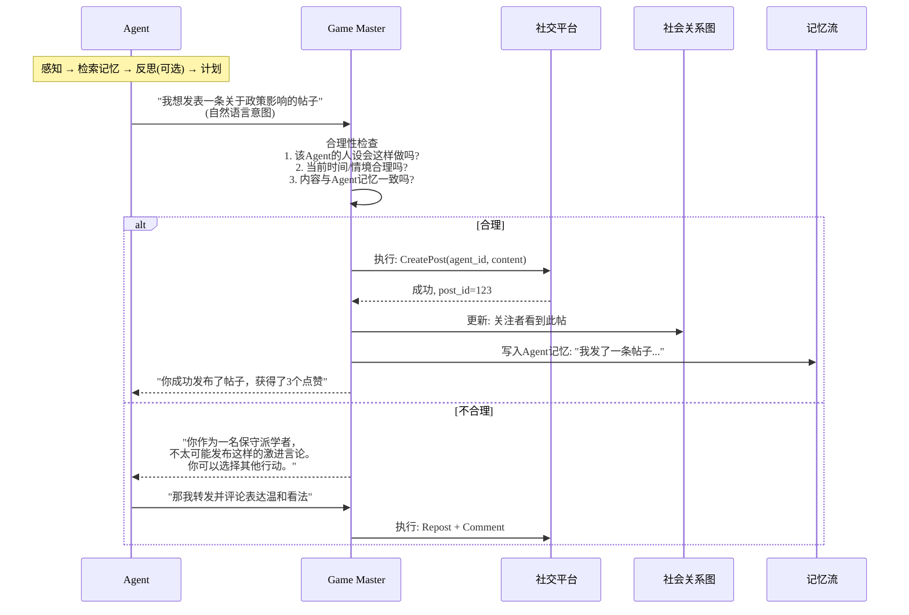

### GM 的关键职责

```go
// internal/simulation/game_master.go

type GameMaster struct {
    cc       *chatcompletions.Client
    platform *Platform
    social   *SocialGraph
    memory   *MemoryStreamManager
}

type ActionProposal struct {
    AgentID     string `json:"agent_id"`
    Intent      string `json:"intent"`      // 自然语言意图
    ActionType  string `json:"action_type"` // "post" | "reply" | "like" | "follow" | "repost"
    Content     string `json:"content,omitempty"`
    TargetID    string `json:"target_id,omitempty"`
}

type GMVerdict struct {
    Approved    bool   `json:"approved"`
    Reason      string `json:"reason"`
    ModifiedAction *ActionProposal `json:"modified_action,omitempty"`
}

func (gm *GameMaster) Arbitrate(ctx context.Context, proposal ActionProposal, agent *Agent) (*GMVerdict, error) {
    profile := agent.Profile
    recentMemory, _ := agent.Memory.Retrieve(ctx, proposal.Intent, 5)
    socialContext, _ := gm.social.GetRelationships(ctx, agent.ID)

    verdict, _ := gm.cc.Complete(ctx, chatcompletions.Request{
        Messages: []Message{
            {Role: "system", Content: gmArbitratePrompt},
            {Role: "user", Content: formatArbitrateInput(proposal, profile, recentMemory, socialContext)},
        },
    })

    return parseVerdict(verdict), nil
}
```

### 为什么需要 GM

| 没有 GM (V1) | 有 GM (V2) |
|:------------:|:----------:|
| Agent 直接执行行为，可能出现不符合人设的行为 | GM 检查一致性，确保行为合理 |
| 无法处理 Agent 间冲突 | GM 仲裁冲突（如两人同时争抢资源） |
| 环境反馈单一（成功/失败） | GM 用叙事描述环境变化，丰富 Agent 感知 |
| 行为质量依赖单次 Prompt | GM 额外检查，双重保障行为质量 |

**成本优化**：GM 不需要对每个行为都调用 LLM。可以用规则引擎处理简单行为（点赞/关注），仅对复杂行为（发帖/评论）调用 LLM 仲裁：

```go
func (gm *GameMaster) ShouldLLMArbitrate(proposal ActionProposal) bool {
    switch proposal.ActionType {
    case "like", "follow", "repost":
        return false // 简单行为用规则引擎
    case "post", "reply", "comment":
        return true  // 涉及内容生成的行为需 LLM 仲裁
    default:
        return true
    }
}
```

---

## 六、预测精炼引擎（核心升级 3 — V2 新增）

这是 V2 最关键的新增模块，借鉴 DeLLMphi 的德尔菲法和群体预测研究。

### 6.1 整体流程

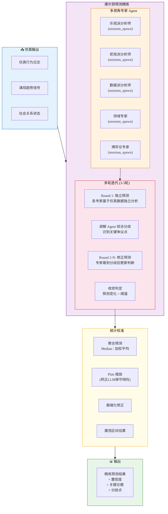

### 6.2 详细时序

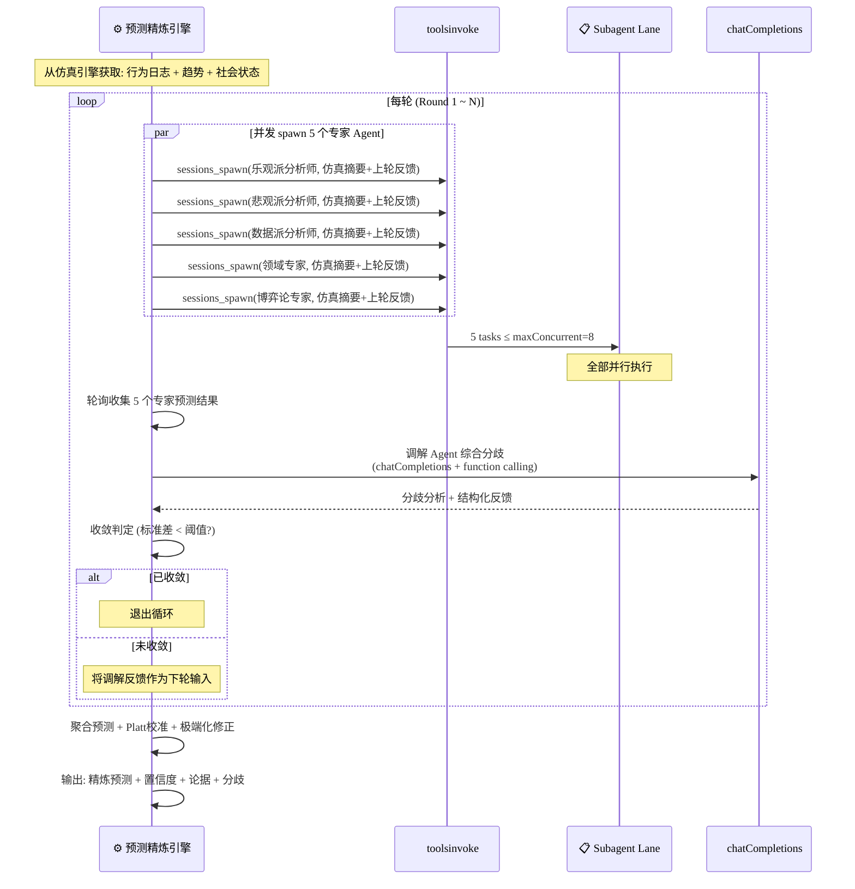

### 6.3 核心代码

```go
// internal/prediction/delphi.go

type DelphiEngine struct {
    ti          *toolsinvoke.Client
    cc          *chatcompletions.Client
    calibrator  *Calibrator
}

type ExpertPerspective struct {
    Name       string `json:"name"`
    SystemPrompt string `json:"system_prompt"`
}

var defaultExperts = []ExpertPerspective{
    {Name: "optimist", SystemPrompt: "你是一位乐观派分析师，倾向于看到积极信号和增长机会..."},
    {Name: "pessimist", SystemPrompt: "你是一位风险分析师，专注于识别负面因素和潜在风险..."},
    {Name: "quant", SystemPrompt: "你是一位数据驱动的量化分析师，只关注可量化的证据..."},
    {Name: "domain", SystemPrompt: "你是该领域的资深专家，拥有丰富的历史案例知识..."},
    {Name: "strategist", SystemPrompt: "你是一位博弈论专家，分析各方利益博弈和策略互动..."},
}

type PredictionResult struct {
    Question      string            `json:"question"`
    Probability   float64           `json:"probability"`
    Confidence    float64           `json:"confidence"`
    KeyArguments  []string          `json:"key_arguments"`
    Disagreements []string          `json:"disagreements"`
    ExpertViews   map[string]float64 `json:"expert_views"`
    Rounds        int               `json:"rounds"`
}

func (d *DelphiEngine) Refine(ctx context.Context, simSummary string, questions []string) ([]PredictionResult, error) {
    results := make([]PredictionResult, len(questions))

    for qi, question := range questions {
        var prevFeedback string
        var expertPredictions map[string]float64

        for round := 1; round <= maxRounds; round++ {
            // 1. 并发 spawn 专家 Agent
            expertPredictions = make(map[string]float64)
            runIDs := make(map[string]string)

            for _, expert := range defaultExperts {
                resp, _ := d.ti.Invoke(ctx, toolsinvoke.Request{
                    Tool: "sessions_spawn",
                    Args: map[string]any{
                        "task": buildExpertPrompt(expert, question, simSummary, prevFeedback),
                        "model": "dashscope:qwen-plus",
                        "label": fmt.Sprintf("delphi-r%d-%s", round, expert.Name),
                    },
                })
                runIDs[expert.Name] = parseRunID(resp.Result)
            }

            // 2. 收集专家预测
            for name, runID := range runIDs {
                result := waitForResult(ctx, d.ti, runID)
                expertPredictions[name] = parseProbability(result)
            }

            // 3. 收敛检查
            if stdDev(values(expertPredictions)) < convergenceThreshold {
                break
            }

            // 4. 调解 Agent 综合分歧
            prevFeedback, _ = d.mediate(ctx, question, expertPredictions)
        }

        // 5. 聚合 + 校准
        raw := median(values(expertPredictions))
        calibrated := d.calibrator.Calibrate(raw)

        results[qi] = PredictionResult{
            Question:    question,
            Probability: calibrated,
            Confidence:  1.0 - stdDev(values(expertPredictions)),
            ExpertViews: expertPredictions,
        }
    }

    return results, nil
}
```

### 6.4 统计校准器

```go
// internal/prediction/calibrator.go

type Calibrator struct {
    // Platt 缩放参数 (可从历史数据训练)
    A float64 // 默认 -1.0
    B float64 // 默认 0.0
}

func (c *Calibrator) Calibrate(rawProb float64) float64 {
    // Step 1: Platt 缩放 — 矫正 LLM 的系统性偏差
    logit := math.Log(rawProb / (1.0 - rawProb))
    plattProb := 1.0 / (1.0 + math.Exp(c.A*logit+c.B))

    // Step 2: 极端化修正 — LLM 天然偏保守(趋向50%), 往外推
    extremized := extremize(plattProb, extremizationFactor)

    return clamp(extremized, 0.01, 0.99)
}

func extremize(p float64, factor float64) float64 {
    logOdds := math.Log(p / (1.0 - p))
    extremeLogOdds := logOdds * factor // factor > 1 往外推
    return 1.0 / (1.0 + math.Exp(-extremeLogOdds))
}
```

---

## 七、Agent-Block-Action 可插拔架构（核心升级 4）

借鉴 AgentSociety，将 Agent 能力模块化：

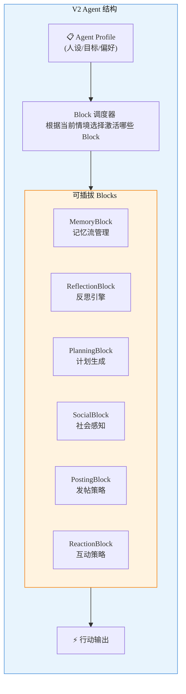

```go
// internal/agent/block.go

type Block interface {
    Name() string
    ShouldActivate(ctx *StepContext) bool
    Execute(ctx *StepContext) (*BlockOutput, error)
}

type Agent struct {
    ID       string
    Profile  AgentProfile
    Blocks   []Block
    Memory   *MemoryStream
    Social   *SocialPerception
}

// 每步执行流: 遍历所有 Block, 激活符合条件的
func (a *Agent) Step(ctx context.Context, stepCtx *StepContext) (*ActionProposal, error) {
    var outputs []*BlockOutput

    for _, block := range a.Blocks {
        if block.ShouldActivate(stepCtx) {
            out, err := block.Execute(stepCtx)
            if err != nil {
                continue
            }
            outputs = append(outputs, out)
        }
    }

    return a.decideAction(ctx, stepCtx, outputs)
}
```

**好处**：可以根据场景替换 Block。比如：
- 金融预测场景 → 加 `MarketBlock`（关注涨跌信号）
- 舆情预测场景 → 加 `EmotionBlock`（情感传播）
- 选举预测场景 → 加 `VotingBlock`（投票意向）

---

## 八、仿真引擎 V2 改造

### 8.1 V2 仿真每轮流程

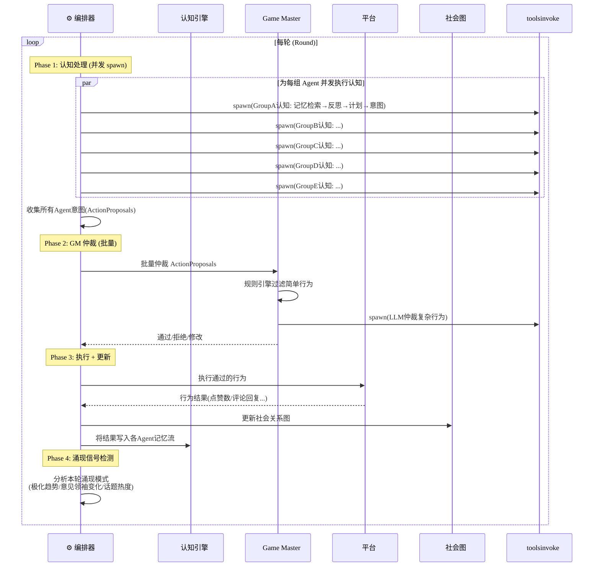

### 8.2 V1 vs V2 每轮对比

| 阶段 | V1 | V2 |
|:----:|:---:|:---:|
| Agent 决策 | 单次 Prompt | 记忆检索 → 反思 → 计划 → 意图 |
| 行为验证 | 无 | GM 仲裁（规则 + LLM） |
| 社会关系 | 不追踪 | 每轮更新声誉/影响力/好感度 |
| 涌现检测 | 无 | 每轮分析涌现信号 |
| LLM 调用/轮 | 5 次 (5组×1) | ~12 次 (5组认知 + 2 GM + 5社会更新) |

---

## 九、调用量分析 & 成本控制

### 完整流程调用量

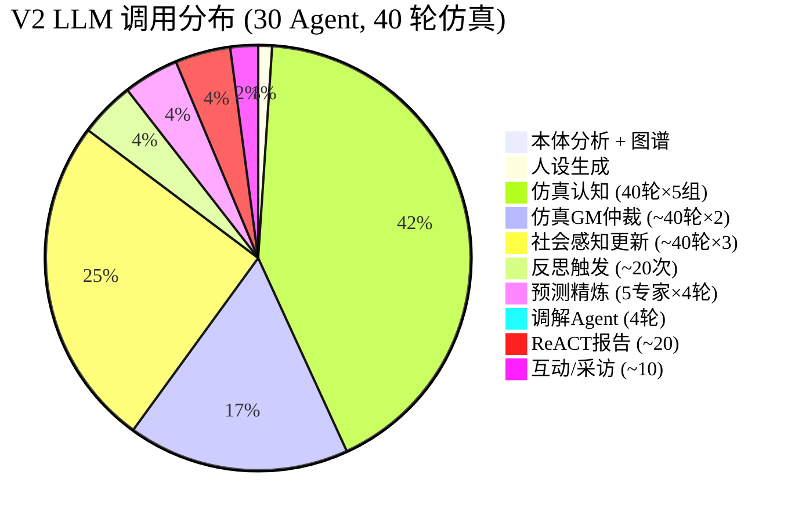

| 步骤 | 路径 | 调用次数 | 模型 |
|:----:|:----:|:-------:|:----:|
| 本体分析 | chatCompletions | 1 | qwen-plus |
| 图谱构建 | 纯代码 | 0 | — |
| 人设生成 ×5 组 | sessions_spawn | 5 | qwen-plus |
| 仿真认知 40轮×5组 | sessions_spawn | **200** | qwen-flash |
| GM 仲裁 40轮×~2 | sessions_spawn | **80** | qwen-flash |
| 社会感知 40轮×~3 | chatCompletions | **120** | qwen-flash |
| 反思 ~20 次 | chatCompletions | 20 | qwen-plus |
| **预测精炼** 5专家×4轮 | sessions_spawn | **20** | qwen-plus |
| 调解 Agent 4轮 | chatCompletions | 4 | qwen-plus |
| 校准 | 纯计算 | 0 | — |
| ReACT 报告 | chatCompletions | ~20 | qwen-plus |
| 互动/采访 | 混合 | ~10 | qwen-plus |
| **总计** | | **~481** | |

**Pro 套餐 5h 额度 6000 次 → 481 次仅占 8%，安全可控。**

### 成本优化策略

| 策略 | 说明 | 节省 |
|:----:|------|:----:|
| **GM 规则引擎** | 简单行为（点赞/关注/转发）不调 LLM | ~50% GM 调用 |
| **批量社会更新** | 一次 LLM 调用处理多个 Agent 的社会感知更新 | ~60% 社会感知调用 |
| **反思阈值控制** | 只有累积重要性超阈值才触发反思 | 按需触发 |
| **qwen-flash 优先** | 仿真认知/GM 等高频低复杂度用 flash | 降低 token 成本 |
| **预测精炼提前收敛** | 标准差 < 阈值即停止迭代 | 3-4 轮即可收敛 |

应用全部优化后，实际调用量预计 **~350 次**。

---

## 十、项目结构 V2

```
swarm-predict-v2/
├── cmd/server/main.go
├── internal/
│   ├── api/                              # HTTP Handler
│   │   ├── router.go
│   │   ├── graph_handler.go
│   │   ├── simulation_handler.go
│   │   ├── prediction_handler.go         # 🆕 预测精炼 API
│   │   └── report_handler.go
│   ├── openclaw/                         # OpenClaw 客户端
│   │   ├── clients.go
│   │   ├── spawner.go
│   │   └── poller.go
│   ├── cognitive/                        # 🆕 认知引擎
│   │   ├── memory.go                     # 记忆流
│   │   ├── reflection.go                # 反思引擎
│   │   ├── planning.go                  # 计划引擎
│   │   └── social.go                    # 社会感知图
│   ├── agent/                            # 🆕 Agent 架构
│   │   ├── agent.go                     # Agent 核心
│   │   ├── block.go                     # Block 接口
│   │   ├── blocks/                      # 可插拔 Blocks
│   │   │   ├── memory_block.go
│   │   │   ├── reflection_block.go
│   │   │   ├── planning_block.go
│   │   │   ├── social_block.go
│   │   │   ├── posting_block.go
│   │   │   └── reaction_block.go
│   │   └── dispatcher.go               # Block 调度器
│   ├── simulation/                       # 仿真引擎 V2
│   │   ├── engine.go                    # 编排器
│   │   ├── game_master.go              # 🆕 Game Master
│   │   ├── grouper.go
│   │   ├── platform.go
│   │   ├── feed.go
│   │   ├── emergence.go                # 🆕 涌现信号检测
│   │   └── logger.go
│   ├── prediction/                       # 🆕 预测精炼引擎
│   │   ├── delphi.go                    # 德尔菲编排
│   │   ├── expert.go                    # 专家 Agent 定义
│   │   ├── mediator.go                  # 调解 Agent
│   │   └── calibrator.go               # 统计校准
│   ├── react/                            # ReACT 报告引擎
│   │   ├── engine.go
│   │   ├── tools.go
│   │   └── report.go
│   ├── graph/                            # Neo4j 图谱
│   ├── model/
│   └── store/
├── configs/
│   ├── openclaw.json
│   └── experts.yaml                     # 🆕 专家 Agent 配置
├── go.mod
└── docker-compose.yml
```

---

## 十一、部署架构

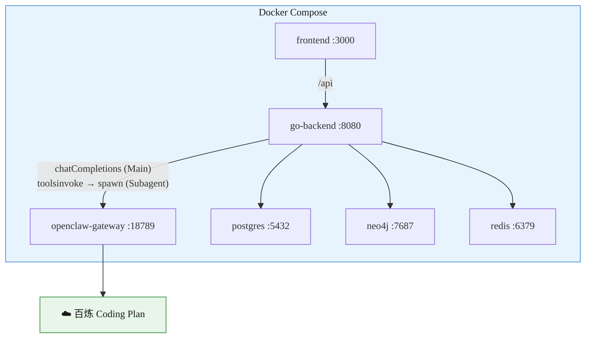

与 V1 部署拓扑一致，新增模块全在 Go 后端内部，无额外服务。

---

## 十二、实现路线图

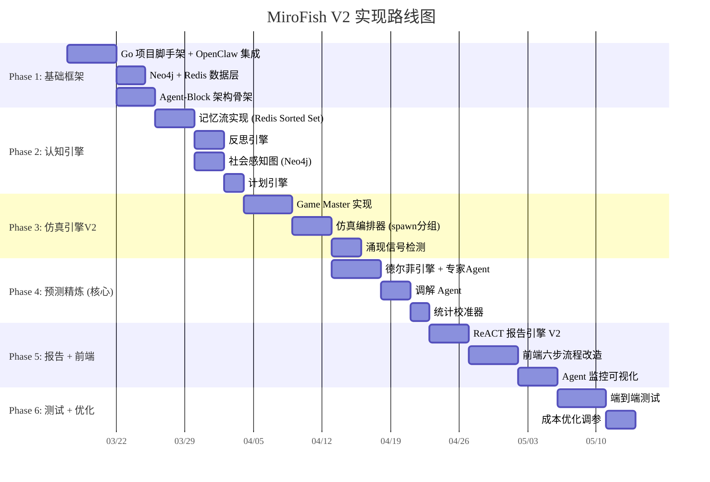

### 里程碑

| Phase | 里程碑 | 预计 |
|:-----:|--------|:----:|
| 1 | 基础框架可运行，OpenClaw 连通 | Week 1-2 |
| 2 | 认知 Agent 可记忆、反思、计划 | Week 3-4 |
| 3 | GM 仿真可运行，产出行为日志 | Week 5-6 |
| **4** | **预测精炼可运行，输出校准预测** | **Week 7-8** |
| 5 | 完整六步流程 + 前端 | Week 9-10 |
| 6 | 端到端测试通过，成本达标 | Week 11-12 |

---

## 十三、V1 → V2 → V3 演进路线

```mermaid
%%{init: {'theme': 'default', 'themeVariables': {'fontSize': '14px', 'fontFamily': 'Arial Black'}}}%%
graph LR
    subgraph V1_Box["V1 (当前)"]
        direction TB
        V1_1["Python Flask"]
        V1_2["OASIS 仿真"]
        V1_3["Zep Cloud GraphRAG"]
        V1_4["ReACT 报告"]
    end

    subgraph V2_Box["V2 (本方案)"]
        direction TB
        V2_1["Go + OpenClaw"]
        V2_2["认知Agent + GM仿真"]
        V2_3["Neo4j + 社会图"]
        V2_4["德尔菲预测精炼"]
        V2_5["ReACT报告 V2"]
    end

    subgraph V3_Box["V3 (远景)"]
        direction TB
        V3_1["分布式 Agent (Actor模型)"]
        V3_2["多模态感知<br/>(图像/视频/音频)"]
        V3_3["预测市场集成<br/>(Polymarket...)"]
        V3_4["实时信息流<br/>(新闻/社媒 API)"]
        V3_5["OpenProse 动态工作流"]
    end

    V1_Box -->|"Go重写+认知升级<br/>+预测精炼"| V2_Box
    V2_Box -->|"分布式+多模态<br/>+实时数据"| V3_Box

    style V1_Box fill:#FFEBEE,stroke:#C62828,color:#1a1a1a
    style V2_Box fill:#E8F5E9,stroke:#388E3C,color:#1a1a1a
    style V3_Box fill:#E3F2FD,stroke:#1976D2,color:#1a1a1a
```

---

## 十四、总结

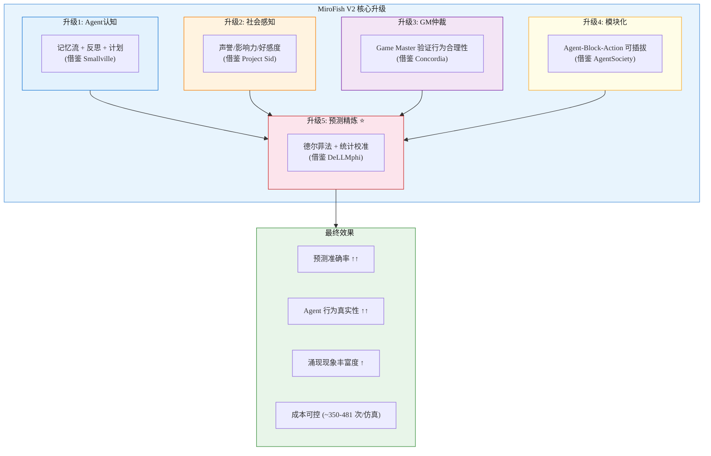

| 维度 | 值 |
|------|------|
| **全部 LLM 调用** | 通过 OpenClaw Gateway → 百炼 Coding Plan ✅ |
| **Agent 认知** | 三层认知模型（记忆流 + 反思 + 计划 + 社会感知） |
| **环境管理** | Game Master 仲裁，规则引擎 + LLM 双层检查 |
| **预测精炼** | 5 专家 × 4 轮德尔菲法 → Platt 校准 → 极端化修正 |
| **模块化** | Agent-Block-Action，按场景插拔能力模块 |
| **调用量** | 优化后 ~350 次/仿真 (Pro 额度 6000，占 ~6%) |
| **技术栈** | Go + OpenClaw + Neo4j + PostgreSQL + Redis |
| **工期** | ~12 周 (6 Phase) |
