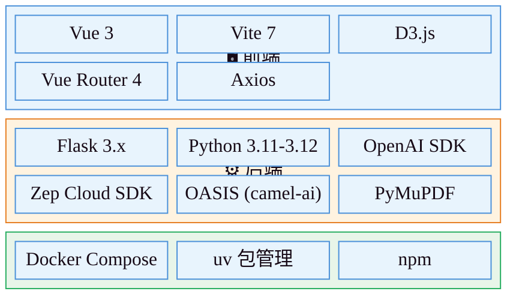
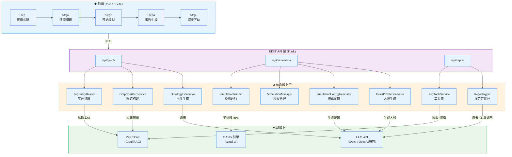
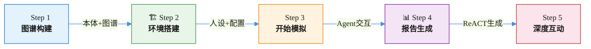
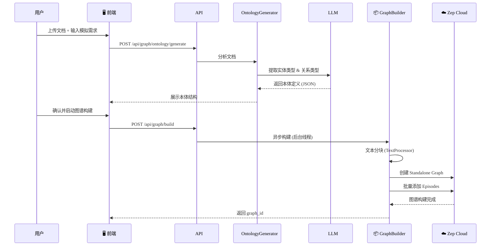
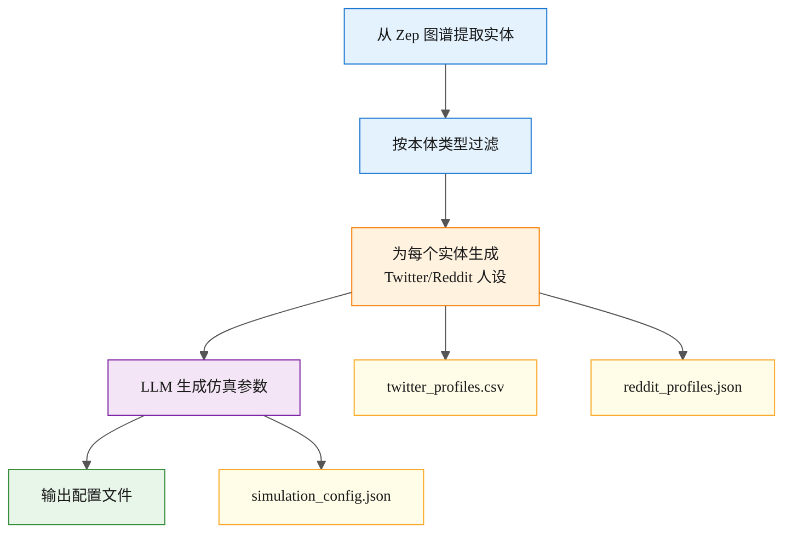
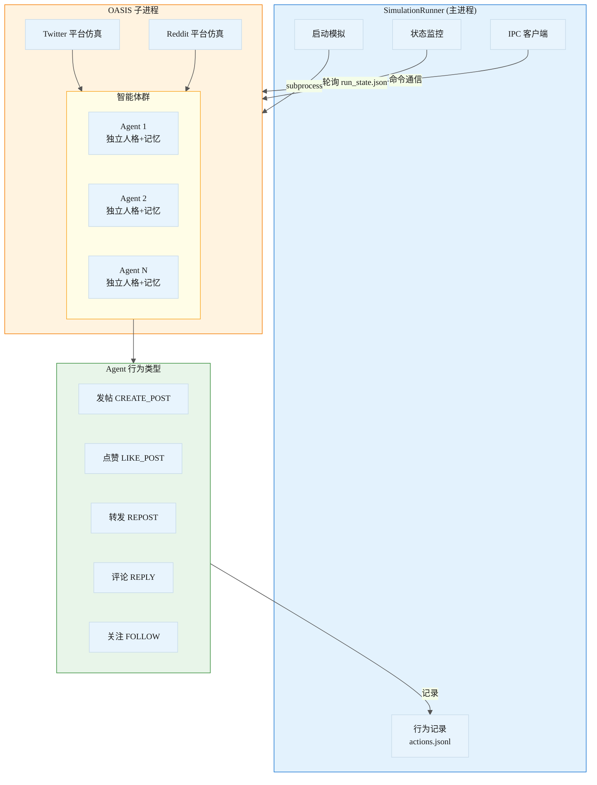
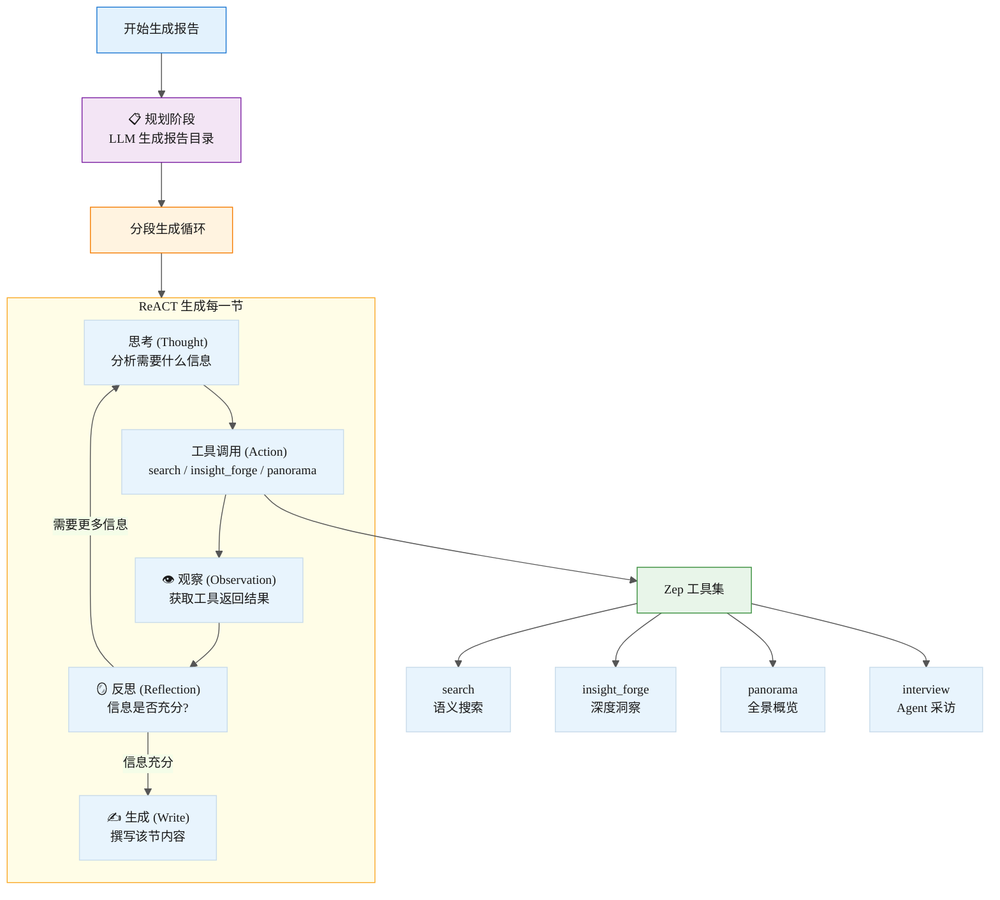
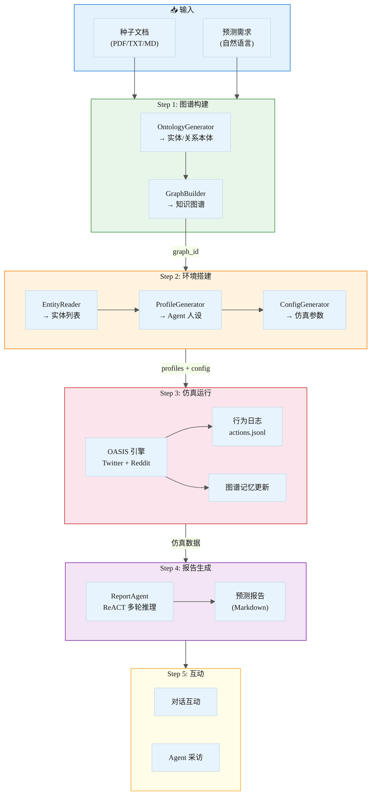
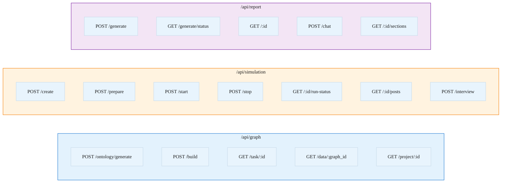
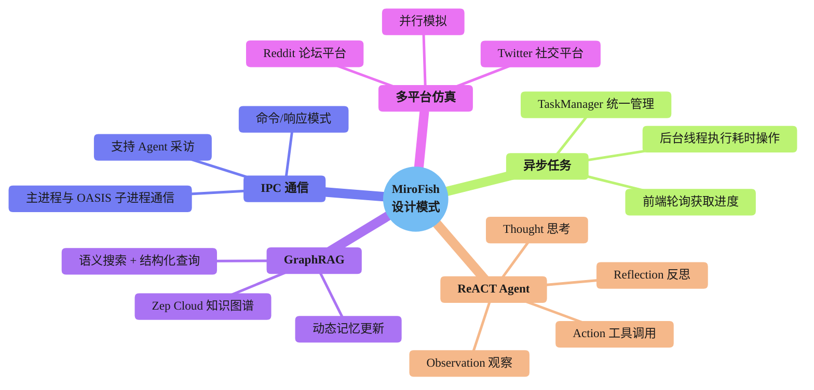

# MiroFish 项目总结

> **MiroFish** — 简洁通用的群体智能引擎，预测万物
>
> A Simple and Universal Swarm Intelligence Engine, Predicting Anything

---

## 一、项目概述

MiroFish 是一款基于**多智能体（Multi-Agent）技术**的新一代 AI 预测引擎。它通过提取现实世界的种子信息（突发新闻、政策草案、金融信号、小说故事等），自动构建出高保真的**平行数字世界**。在该世界中，成千上万个具备独立人格、长期记忆与行为逻辑的智能体自由交互与社会演化，从而推演未来走向并生成预测报告。

**核心定位：**

| 维度 | 描述 |
|------|------|
| **宏观** | 决策者的预演实验室，让政策与公关在零风险中试错 |
| **微观** | 个人用户的创意沙盘，推演小说结局或探索脑洞 |

---

## 二、技术栈



---

## 三、系统架构



---

## 四、五步工作流程



### 各步骤详解

| 步骤 | 名称 | 功能描述 | 核心服务 |
|:----:|:----:|---------|---------|
| **1** | **图谱构建** | 上传种子文档 + 描述预测需求 → LLM 分析生成本体（实体/关系类型） → Zep 构建知识图谱 | `OntologyGenerator` `GraphBuilderService` |
| **2** | **环境搭建** | 从图谱提取实体 → 生成 Agent 人设档案 → LLM 配置仿真参数（时间、事件、轮次） | `ZepEntityReader` `OasisProfileGenerator` `SimulationConfigGenerator` |
| **3** | **开始模拟** | 启动 OASIS 引擎 → Twitter/Reddit 双平台并行仿真 → Agent 自由交互 → 动态记录行为 | `SimulationRunner` `OASIS` |
| **4** | **报告生成** | ReportAgent 使用 ReACT 模式 → 调用 Zep 工具集检索 → 多轮思考 → 分段生成预测报告 | `ReportAgent` `ZepToolsService` |
| **5** | **深度互动** | 与 ReportAgent 对话追问 → 与模拟世界中的任意 Agent 进行对话采访 | `ReportAgent.chat()` `SimulationRunner.interview()` |

---

## 五、核心功能模块详解

### 5.1 图谱构建模块



**实现要点：**
- `OntologyGenerator` 使用精心设计的系统提示词引导 LLM 输出实体类型（如个人、机构、媒体）和关系类型（如批评、合作、影响）
- `GraphBuilderService` 使用 `TextProcessor` 对长文本进行智能分块（默认 500 字符/块，50 字符重叠）
- 通过 Zep Cloud 的 Standalone Graph API 构建知识图谱，支持 GraphRAG 语义检索
- 图谱构建是异步任务，前端通过轮询 `GET /api/graph/task/<task_id>` 获取进度

### 5.2 环境搭建模块



**实现要点：**
- `ZepEntityReader` 从 Zep 图谱读取实体节点，并按照本体定义的类型进行过滤
- `OasisProfileGenerator` 为每个实体生成两套人设（Twitter 简介 + Reddit 简介），包含性格、身份、行为倾向
- `SimulationConfigGenerator` 根据预测需求，由 LLM 自动配置仿真时间跨度、轮次数、事件注入等参数
- 所有生成过程均为异步任务，前端通过 `POST /api/simulation/prepare/status` 轮询进度

### 5.3 OASIS 仿真引擎



**实现要点：**
- `SimulationRunner` 通过 `subprocess` 启动 OASIS 引擎（`run_parallel_simulation.py`），以独立进程运行
- 支持 **Twitter + Reddit 双平台并行仿真**，Agent 在两个社交平台上同时活动
- 每个 Agent 拥有独立的人格、记忆和行为逻辑，由 LLM 驱动决策
- 通过 `SimulationIPCClient` 实现主进程与 OASIS 子进程的进程间通信（IPC），支持 Agent 采访等交互命令
- `ZepGraphMemoryManager` 可选地将仿真中产生的 Agent 行为回写到 Zep 图谱，实现**动态时序记忆更新**
- 所有 Agent 行为记录在 `actions.jsonl` 中，运行状态通过 `run_state.json` 轮询

### 5.4 ReportAgent (ReACT 模式)



**实现要点：**
- `ReportAgent` 采用 **ReACT（Reasoning + Acting）** 模式，先思考再行动
- 首先由 LLM 规划报告目录结构，然后逐节生成
- 每一节的生成经历多轮 Thought → Action → Observation → Reflection 循环
- **工具集（ZepToolsService）** 提供四大能力：
  - `search`：基于 Zep GraphRAG 的语义搜索
  - `insight_forge`：深度洞察分析，发现隐藏模式
  - `panorama`：全景概览，获取图谱统计信息
  - `interview`：对仿真中的 Agent 进行采访
- 详细日志通过 `ReportLogger` 记录在 `agent_log.jsonl`，前端可实时展示 Agent 思考过程

### 5.5 深度互动模块

用户可与两类对象进行对话：

| 对话对象 | 实现方式 | 用途 |
|:--------:|---------|------|
| **ReportAgent** | `ReportAgent.chat()` — 带工具调用的对话 | 追问报告细节、请求补充分析 |
| **仿真 Agent** | `SimulationRunner.interview_agent()` — IPC 通信 | 采访仿真世界中的任意角色，了解其想法 |

---

## 六、数据流总览



---

## 七、API 接口总览



---

## 八、项目目录结构

```
MiroFish/
├── backend/                          # Python Flask 后端
│   ├── app/
│   │   ├── api/                      # REST API 路由
│   │   │   ├── graph.py              # 图谱相关 API
│   │   │   ├── simulation.py         # 仿真相关 API
│   │   │   └── report.py             # 报告相关 API
│   │   ├── config.py                 # 配置管理
│   │   ├── models/                   # 数据模型
│   │   │   ├── project.py            # 项目模型 + ProjectManager
│   │   │   └── task.py               # 异步任务模型 + TaskManager
│   │   ├── services/                 # 核心业务逻辑
│   │   │   ├── ontology_generator.py # 本体生成 (LLM)
│   │   │   ├── graph_builder.py      # 图谱构建 (Zep)
│   │   │   ├── zep_entity_reader.py  # 实体读取
│   │   │   ├── oasis_profile_generator.py  # Agent 人设生成
│   │   │   ├── simulation_config_generator.py  # 仿真配置生成
│   │   │   ├── simulation_manager.py # 仿真管理
│   │   │   ├── simulation_runner.py  # 仿真运行器 (OASIS)
│   │   │   ├── simulation_ipc.py     # IPC 通信客户端
│   │   │   ├── report_agent.py       # ReACT 报告智能体
│   │   │   ├── zep_tools.py          # Zep 工具集
│   │   │   └── zep_graph_memory_updater.py  # 图谱记忆更新
│   │   └── utils/                    # 工具类
│   │       ├── llm_client.py         # LLM 统一客户端
│   │       ├── file_parser.py        # 文件解析器
│   │       └── logger.py             # 日志模块
│   ├── scripts/                      # OASIS 仿真脚本
│   └── run.py                        # 后端入口
├── frontend/                         # Vue 3 前端 SPA
│   ├── src/
│   │   ├── api/                      # API 客户端封装
│   │   │   ├── index.js              # Axios 实例
│   │   │   ├── graph.js              # 图谱 API
│   │   │   ├── simulation.js         # 仿真 API
│   │   │   └── report.js             # 报告 API
│   │   ├── components/               # 步骤组件
│   │   │   ├── Step1GraphBuild.vue   # 图谱构建
│   │   │   ├── Step2EnvSetup.vue     # 环境搭建
│   │   │   ├── Step3Simulation.vue   # 仿真运行
│   │   │   ├── Step4Report.vue       # 报告生成
│   │   │   └── Step5Interaction.vue  # 深度互动
│   │   ├── views/                    # 页面视图
│   │   ├── App.vue                   # 根组件
│   │   └── main.js                   # 前端入口
│   └── vite.config.js                # Vite 配置
├── .env.example                      # 环境变量模板
├── docker-compose.yml                # Docker 部署
├── package.json                      # 根包 (concurrently)
└── README.md                         # 项目文档
```

---

## 九、关键设计模式



| 模式 | 说明 |
|------|------|
| **异步任务模式** | 图谱构建、环境搭建、报告生成等耗时操作均在后台线程执行，前端通过轮询获取任务状态 |
| **ReACT Agent** | 报告生成采用 Reasoning + Acting 循环模式，Agent 自主决定何时调用工具、何时生成内容 |
| **IPC 进程间通信** | `SimulationIPCClient` 实现主进程与 OASIS 子进程的命令通信，支持 Agent 采访等交互场景 |
| **GraphRAG** | 基于 Zep Cloud 的知识图谱，结合语义搜索与图结构查询，为 ReportAgent 提供丰富的上下文 |
| **文件存储** | 项目、仿真、报告数据以文件形式存储在 `backend/uploads/` 下，通过 ProjectManager/TaskManager 管理 |

---

## 十、部署方式

| 方式 | 命令 | 端口 |
|:----:|------|:----:|
| **源码部署** | `npm run setup:all && npm run dev` | 前端 3000 / 后端 5001 |
| **Docker** | `docker compose up -d` | 前端 3000 / 后端 5001 |

**环境变量要求：**

| 变量 | 必需 | 用途 |
|------|:----:|------|
| `LLM_API_KEY` | ✅ | LLM API 密钥 (推荐阿里百炼 Qwen) |
| `LLM_BASE_URL` | ✅ | LLM API 地址 |
| `LLM_MODEL_NAME` | ✅ | LLM 模型名称 |
| `ZEP_API_KEY` | ✅ | Zep Cloud API 密钥 |
| `LLM_BOOST_*` | ❌ | 可选的加速 LLM 配置 |
